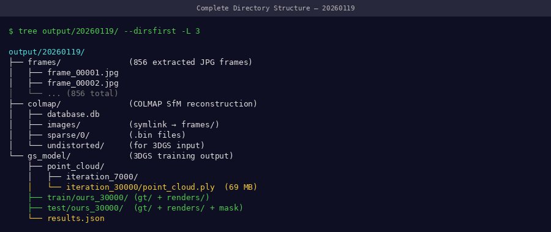
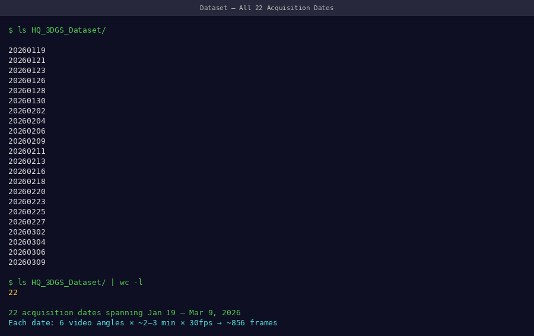
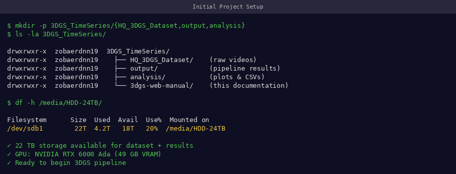

# Directory Structure

How to organize your data for the 3DGS pipeline.

---

## Required Structure

Each capture date must follow this exact layout:

```
data/
└── 20260119/                    ← date folder (YYYYMMDD format)
    ├── video.mp4                ← raw input video
    ├── frames/                  ← extracted JPEG frames (Stage 1 output)
    │   ├── frame_0001.jpg
    │   ├── frame_0002.jpg
    │   └── ... (~329 files)
    ├── database.db              ← COLMAP database (auto-created)
    ├── sparse/                  ← COLMAP output (Stage 2 output)
    │   └── 0/
    │       ├── cameras.bin
    │       ├── images.bin
    │       └── points3D.bin
    └── output/                  ← 3DGS model (Stage 3 output)
        ├── cameras.json
        ├── cfg_args
        ├── input.ply
        └── point_cloud/
            └── iteration_30000/
                └── point_cloud.ply
```

!!! tip "📸 Screenshot to capture"
    Screenshot your actual data directory open in a file browser — show the date folder containing all subfolders after completing the full pipeline.

{ width="100%" }
*A complete date folder after running all 5 pipeline stages — all subfolders populated*

---

## Full Multi-Date Dataset

For a time-series study with multiple dates:

```
data/
├── 20260101/
│   ├── video.mp4
│   ├── frames/
│   ├── sparse/
│   └── output/
├── 20260108/
│   ├── video.mp4
│   ├── frames/
│   ├── sparse/
│   └── output/
├── 20260115/
│   └── ...
└── 20260119/
    └── ...

results/
├── traits_20260101.csv
├── traits_20260108.csv
├── traits_20260115.csv
├── traits_20260119.csv
└── all_traits.csv              ← combined time-series
```

!!! tip "📸 Screenshot to capture"
    Screenshot the top-level `data/` directory showing all 22 date folders.

{ width="100%" }
*Top-level data directory with all 22 capture dates — each folder is a self-contained reconstruction*

---

## Setting Up the Structure

Create the folder structure before running any pipeline stage:

```bash
# Create date directory
DATE="20260119"
mkdir -p data/$DATE/frames
mkdir -p data/$DATE/sparse

# Copy or move your video
cp /path/to/recording.mp4 data/$DATE/video.mp4

# Verify
ls data/$DATE/
# frames/  video.mp4
```

!!! tip "📸 Screenshot to capture"
    Screenshot the terminal showing `ls data/$DATE/` after setup — confirms video.mp4 and empty frames/ folder are ready.

{ width="100%" }
*Initial directory state before pipeline — just video.mp4 and empty frames/ folder needed to start*

---

## Disk Space by Stage

| After Stage | New Files | Cumulative Size |
|------------|-----------|----------------|
| Setup | `video.mp4` | ~2 GB |
| Stage 1 (frames) | `frames/*.jpg` (~329 files) | ~3.5 GB |
| Stage 2 (COLMAP) | `database.db` + `sparse/` | ~3.7 GB |
| Stage 3 (3DGS) | `output/point_cloud/` | ~4.0 GB |
| Stage 4 (renders) | `output/train/` + `output/test/` | ~6.5 GB |

**Per date: ~6.5 GB** · **22 dates: ~143 GB** · **Recommended storage: 500 GB+**

---

## Naming Convention Rules

| Item | Format | Example | Why |
|------|--------|---------|-----|
| Date folders | `YYYYMMDD` | `20260119` | Sorts chronologically |
| Video file | `video.mp4` | `video.mp4` | Scripts expect this name |
| Frames | `frame_%04d.jpg` | `frame_0001.jpg` | COLMAP reads in this order |
| Results | `traits_YYYYMMDD.csv` | `traits_20260119.csv` | Matches date folders |

!!! warning "Do not use spaces or special characters in paths"
    COLMAP and 3DGS scripts may fail with paths containing spaces. Use underscores or hyphens only.

---

## Next Step

[→ Dataset Details](dataset.md){ .md-button }
[→ Start Pipeline: Video Processing](../pipeline/video-processing.md){ .md-button .md-button--primary }
