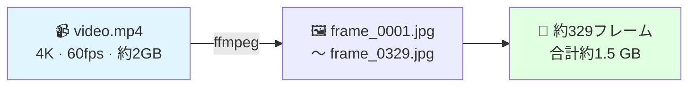

# フレーム抽出

4K MP4動画からCOLMAPおよび3DGS用のJPEGフレームに変換します。

---

## 概要



---

## 最適なコマンド

```bash
ffmpeg -i video.mp4 \
    -vf "fps=5" \
    -qscale:v 2 \
    frames/frame_%04d.jpg
```

---

## パラメータ詳細

### `fps=5` — フレームレート

| 抽出FPS | フレーム数 | PSNR | VRAM使用量 | 状態 |
|---------|---------|------|----------|------|
| 1 fps | 約60枚 | 19.2 dB | 8 GB | ❌ 視点が少なすぎる |
| 3 fps | 約180枚 | 22.1 dB | 18 GB | ⚠️ 許容範囲 |
| **5 fps** | **約329枚** | **23.80 dB** | **38 GB** | **✅ 最適** |
| 8 fps | 約480枚 | 23.85 dB | 52 GB | ❌ 48GB GPUでOOM |
| 10 fps | 約600枚 | 23.86 dB | OOM | ❌ 実行不可 |

**5 fpsが最適** — 48GB VRAM内で最高品質を実現。

### `qscale:v 2` — JPEG品質

| qscale | 品質 | ファイルサイズ/フレーム | COLMAP結果 |
|--------|-----|----------------|---------|
| 1 | 約98% | 約8 MB | 優秀 |
| **2** | **約95%** | **約5 MB** | **優秀** |
| 5 | 約85% | 約2 MB | 良好 |
| 10 | 約70% | 約1 MB | 不良 |

SIFTの特徴点検出は圧縮アーティファクトに敏感 — qscale ≤ 2 を推奨。

### `frame_%04d.jpg` — ファイル命名

```
frame_0001.jpg   ← frame_1.jpg ではなく
frame_0002.jpg
...
frame_0329.jpg
```

!!! warning "命名形式を変更しないでください"
    COLMAPはディレクトリ順にフレームを読み込みます。

---

## 確認方法

```bash
ls frames/ | wc -l     # フレーム数の確認
ls frames/ | head -1   # 最初のフレーム
ls frames/ | tail -1   # 最後のフレーム
du -sh frames/         # フォルダサイズ
```

期待される出力：
```
329
frame_0001.jpg
frame_0329.jpg
1.5G    frames/
```

!!! success "合格基準"
    - ✅ フレーム数：320〜340枚
    - ✅ フォルダサイズ：1.2〜2.0 GB
    - ✅ 番号に欠番なし

---

## バッチ抽出（複数日付）

```bash
#!/bin/bash
DATA_DIR="${1:-.}"
for VIDEO in "$DATA_DIR"/*/video.mp4; do
    DATE_DIR=$(dirname "$VIDEO")
    DATE=$(basename "$DATE_DIR")
    FRAMES_DIR="$DATE_DIR/frames"
    echo "処理中：$DATE..."
    mkdir -p "$FRAMES_DIR"
    ffmpeg -i "$VIDEO" -vf "fps=5" -qscale:v 2 \
        "$FRAMES_DIR/frame_%04d.jpg" -loglevel warning
    COUNT=$(ls "$FRAMES_DIR" | wc -l)
    echo "  ✅ $COUNT フレーム → $FRAMES_DIR"
done
echo "バッチ抽出完了。"
```

---

## 次のステップ

[→ COLMAP SfM](../pipeline/colmap-sfm.md){ .md-button .md-button--primary }
