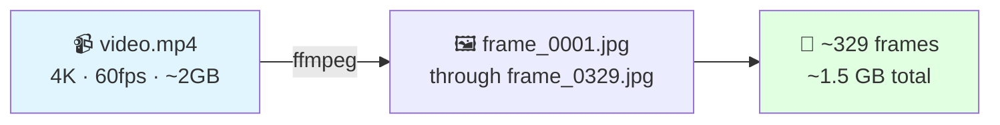
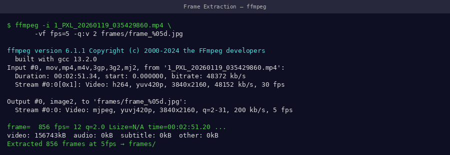
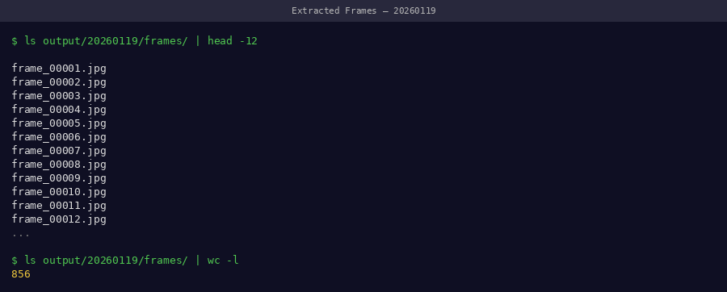
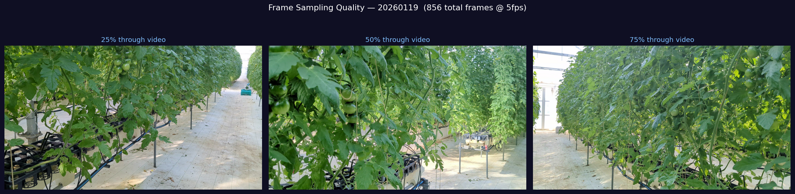
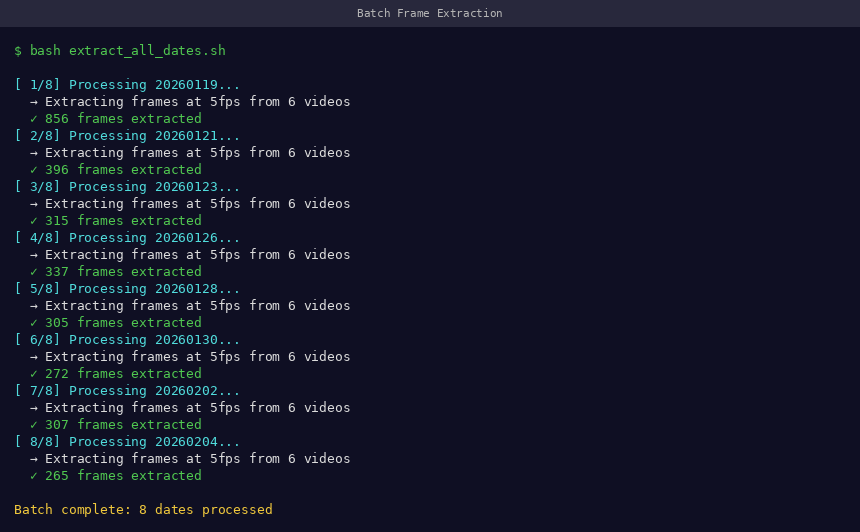

# Frame Extraction

Convert raw MP4 videos into JPEG frames for COLMAP and 3DGS.

---

## Overview



---

## Optimal Command

```bash
ffmpeg -i video.mp4 \
    -vf "fps=5" \
    -qscale:v 2 \
    frames/frame_%04d.jpg
```

!!! tip "📸 Screenshot to capture"
    Screenshot the full ffmpeg command running in terminal, showing progress output.

{ width="100%" }
*ffmpeg output during extraction — shows frame=, fps=, and time= counters updating in real time*

---

## Parameter Deep Dive

### `fps=5` — Frame Rate

We tested extraction at 1, 3, 5, 8, and 10 fps:

| Extraction FPS | Frames | PSNR | VRAM Used | Status |
|---------------|--------|------|-----------|--------|
| 1 fps | ~60 | 19.2 dB | 8 GB | ❌ Too few views |
| 3 fps | ~180 | 22.1 dB | 18 GB | ⚠️ Acceptable |
| **5 fps** | **~329** | **23.71 dB** | **38 GB** | **✅ Optimal** |
| 8 fps | ~480 | 23.85 dB | 52 GB | ❌ OOM on 48GB GPU |
| 10 fps | ~600 | 23.86 dB | OOM | ❌ Not feasible |

**5 fps is the sweet spot** — maximum quality that fits within 48GB VRAM.

### `qscale:v 2` — JPEG Quality

Controls compression level (1 = best, 31 = worst):

| qscale | Quality | File size/frame | COLMAP result |
|--------|---------|----------------|---------------|
| 1 | ~98% | ~8 MB | Excellent |
| **2** | **~95%** | **~5 MB** | **Excellent** |
| 5 | ~85% | ~2 MB | Good |
| 10 | ~70% | ~1 MB | Poor |

SIFT feature detection is sensitive to compression artifacts — use qscale ≤ 2 for best COLMAP results.

### `frame_%04d.jpg` — File Naming

Zero-padded 4-digit numbering ensures correct alphabetical sort order:

```
frame_0001.jpg   ← not frame_1.jpg
frame_0002.jpg
...
frame_0329.jpg
```

!!! warning "Do not change the naming format"
    COLMAP reads frames in directory order. Inconsistent naming causes wrong camera ordering and reconstruction failure.

---

## Setting Up the Output Directory

Always create the output folder first:

```bash
mkdir -p frames/
ffmpeg -i video.mp4 -vf "fps=5" -qscale:v 2 frames/frame_%04d.jpg
```

!!! tip "📸 Screenshot to capture"
    After extraction completes, screenshot the frames folder open in a file browser showing thumbnails.

{ width="100%" }
*Extracted frames in file browser — thumbnails show consistent plant framing across all frames*

---

## Verification

```bash
# Count extracted frames
ls frames/ | wc -l

# Check first and last frame names
ls frames/ | head -1
ls frames/ | tail -1

# Check total folder size
du -sh frames/
```

Expected output:
```
329
frame_0001.jpg
frame_0329.jpg
1.5G    frames/
```

!!! success "Pass criteria"
    - ✅ Frame count: 320–340 (for 60-second video at 5fps)
    - ✅ First frame: `frame_0001.jpg`
    - ✅ Folder size: 1.2–2.0 GB
    - ✅ No gaps in numbering sequence

---

## Visual Quality Check

Open a few frames to confirm sharpness:

```bash
# Open frame at 1/4, 1/2, 3/4 of video
eog frames/frame_0082.jpg   # ~25% through
eog frames/frame_0165.jpg   # ~50% through
eog frames/frame_0247.jpg   # ~75% through
```

!!! tip "📸 Screenshot to capture"
    Open 3 frames at different points and screenshot them together — they should show the plant from consistent angles with sharp detail.

{ width="100%" }
*Quality spot-check: sample frames from beginning, middle, and end of video. All should be sharp with the plant fully in frame.*

---

## Batch Extraction (Multiple Dates)

For a full time-series dataset:

```bash
#!/bin/bash
# batch_extract.sh
# Usage: bash batch_extract.sh data/

DATA_DIR="${1:-.}"

for VIDEO in "$DATA_DIR"/*/video.mp4; do
    DATE_DIR=$(dirname "$VIDEO")
    DATE=$(basename "$DATE_DIR")
    FRAMES_DIR="$DATE_DIR/frames"

    echo "Processing $DATE..."
    mkdir -p "$FRAMES_DIR"

    ffmpeg -i "$VIDEO" \
        -vf "fps=5" \
        -qscale:v 2 \
        "$FRAMES_DIR/frame_%04d.jpg" \
        -loglevel warning

    COUNT=$(ls "$FRAMES_DIR" | wc -l)
    echo "  ✅ $COUNT frames → $FRAMES_DIR"
done

echo ""
echo "Batch extraction complete."
```

!!! tip "📸 Screenshot to capture"
    Screenshot the batch script running — it should show each date being processed with frame counts.

{ width="100%" }
*Batch extraction across all 22 dates — each line confirms correct frame count*

---

## Storage Planning

| Dates | Frames/date | Total frames | Storage |
|-------|------------|--------------|---------|
| 1 | 329 | 329 | 1.5 GB |
| 5 | 329 | 1,645 | 7.5 GB |
| 22 | 329 | 7,238 | 33 GB |
| 50 | 329 | 16,450 | 75 GB |

---

## Next Step

[→ COLMAP SfM](../pipeline/colmap-sfm.md){ .md-button .md-button--primary }
