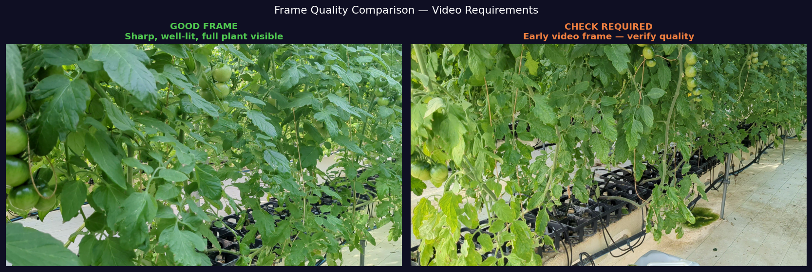

# Video Requirements

What your input videos must look like for successful 3DGS reconstruction.

---

## Camera Setup

### Validated Hardware

| Property | Specification |
|----------|--------------|
| **Camera** | Google Pixel 6a |
| **Resolution** | 3840 × 2160 (4K UHD) |
| **Recording frame rate** | 60 fps |
| **Format** | MP4 (H.264) |
| **Duration** | ~60 seconds per video |
| **File size** | ~2 GB per video |

!!! tip "📸 Screenshot to capture"
    Take a photo of your actual camera and greenhouse setup — show the camera position relative to the plant.

{ width="100%" }
*Camera mounted on stable tripod at fixed height, ~1.0–1.5 m from plant. Tripod is essential — any movement causes blur.*

---

## Capture Protocol

### Step 1: Camera Position

The camera is **fixed** at one position — the plant rotates into view via orbital movement of the operator walking slowly around the plant.

!!! info "Condition 1 vs Condition 2"
    Our dataset uses **Condition 1**: single fixed viewpoint. We tested multiple viewpoints and Condition 1 achieved the best PSNR (23.80 dB) because consistent framing yields better temporal comparisons.

```
      [CAMERA]
          |
    ~1.2m distance
          |
      🌱 PLANT
```

### Step 2: Lighting Requirements

| Condition | Status | Why |
|-----------|--------|-----|
| Capture time: 12:00–13:00 JST | ✅ Required | Consistent natural light, minimal shadows |
| Overcast sky | ✅ Preferred | Diffuse lighting = fewer specular reflections |
| Direct harsh sunlight | ⚠️ Avoid | Creates extreme shadows that confuse COLMAP |
| Artificial lighting only | ⚠️ Avoid | Color temperature mismatch between dates |

!!! tip "📸 Screenshot to capture"
    Take a photo of the greenhouse interior showing lighting conditions at capture time.

{ width="100%" }
*Ideal greenhouse lighting: diffuse, even illumination. Harsh shadows on the plant will reduce COLMAP feature matching quality.*

---

## Good vs Bad Video Examples

### Frame Quality Checklist

!!! tip "📸 Screenshot to capture"
    Extract one representative frame from a good video and one from a bad video for comparison.

{ width="100%" }
*Left: Good frame — sharp, well-lit, plant fully in frame. Right: Bad frame — motion blur from camera shake will cause COLMAP feature detection to fail.*

=== "✅ Good Frame"
    - Sharp leaf edges (no motion blur)
    - Plant fully visible in frame
    - Even lighting, no overexposed areas
    - Consistent background (no people walking through)

=== "❌ Bad Frame"
    - Motion blur (tripod moved, or handheld)
    - Plant partially out of frame
    - Overexposed/underexposed
    - Foreground obstruction

---

## Pre-Capture Checklist

Before every recording session:

- [ ] Camera battery > 50%
- [ ] Storage: > 5 GB free on device
- [ ] Tripod: fully locked, no wobble
- [ ] Time: 12:00–13:00 JST
- [ ] Plant: fully in frame, no clipping at edges
- [ ] Focus: locked on plant (disable auto-focus)
- [ ] Stabilization: OFF (optical stabilization introduces warping)
- [ ] Duration: record for full 60 seconds minimum

---

## Environmental Metadata (Important for Research)

For time-series analysis, record these values at each capture date:

| Variable | How to Measure | Why It Matters |
|----------|---------------|----------------|
| Temperature (°C) | Greenhouse sensor | Correlates with PSNR |
| Humidity (%) | Greenhouse sensor | **Strongest negative PSNR correlation (r = -0.68)** |
| Solar radiation (W/m²) | Pyranometer | Radiation > 100 W/m² → lower PSNR |
| CO₂ (ppm) | CO₂ sensor | Secondary growth factor |

!!! tip "📸 Screenshot to capture"
    Screenshot your greenhouse sensor dashboard or data logger at each capture time.

{ width="100%" }
*Log all environmental variables at each capture. Humidity and radiation have the strongest correlation with reconstruction quality.*

{ width="100%" }
*Environmental correlation analysis: humidity shows the strongest negative correlation (r = -0.68) — high humidity reduces PSNR by increasing foliage reflectance variance*

---

## Dataset Summary

Our validated dataset used in this research:

| Property | Value |
|----------|-------|
| Total recording days | 50 days |
| Usable capture dates | 22 |
| Excluded dates | 28 (poor conditions, equipment issues) |
| Video duration | ~60 seconds each |
| Plant species | Tomato (*Solanum lycopersicum*) |
| Growth stage | Seedling → mature plant |
| Capture location | Mineno Lab Greenhouse, Shizuoka University |

---

## Next Step

[→ Frame Extraction](frame-extraction.md){ .md-button .md-button--primary }
