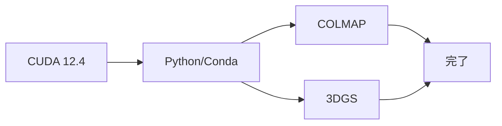

# 環境構築の概要

3DGSパイプラインの完全な環境構築ガイドです。

---

## 概要

パイプラインには3つの主要コンポーネントが必要です：

1. **CUDA** — GPUアクセラレーション
2. **COLMAP** — Structure-from-Motion
3. **3D Gaussian Splatting** — ニューラルレンダリング

---

## インストール順序



---

## 所要時間

| コンポーネント | 時間 | 難易度 |
|-----------|------|--------|
| CUDA | 10分 | 易 |
| Python/Conda | 5分 | 易 |
| COLMAP | 20分 | 中 |
| 3DGS | 15分 | 中 |
| **合計** | **約50分** | **中** |

---

## クイックスタート

手順を把握している方向け：

```bash
# CUDA 12.4のインストール
wget https://developer.download.nvidia.com/compute/cuda/repos/ubuntu2204/x86_64/cuda-keyring_1.1-1_all.deb
sudo dpkg -i cuda-keyring_1.1-1_all.deb
sudo apt-get update && sudo apt-get -y install cuda-toolkit-12-4

# COLMAPのインストール
sudo apt-get install -y colmap

# 3DGSのインストール
git clone https://github.com/graphdeco-inria/gaussian-splatting.git
cd gaussian-splatting
conda create -n 3dgs python=3.10 -y
conda activate 3dgs
pip install torch torchvision --index-url https://download.pytorch.org/whl/cu124
pip install -r requirements.txt --no-build-isolation
```

詳細な手順は各ガイドを順番にご覧ください。
