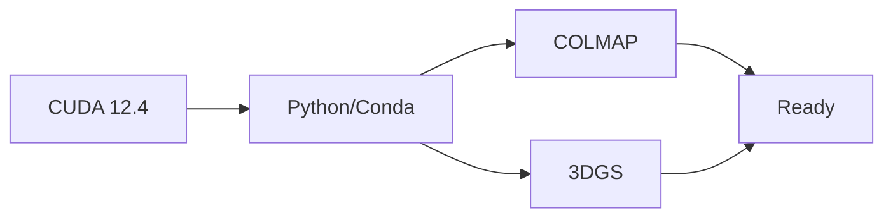

# Environment Setup Introduction

Complete environment setup for the 3DGS pipeline.

## Overview

The pipeline requires three main components:
1. **CUDA** - GPU acceleration
2. **COLMAP** - Structure-from-Motion
3. **3D Gaussian Splatting** - Neural rendering

## Installation Order



## Time Required

| Component | Time | Difficulty |
|-----------|------|------------|
| CUDA | 10 min | Easy |
| Python/Conda | 5 min | Easy |
| COLMAP | 20 min | Medium |
| 3DGS | 15 min | Medium |
| **Total** | **~50 min** | **Medium** |

## Quick Start

Already know what you're doing?

```bash
# Install CUDA 12.4
wget https://developer.download.nvidia.com/compute/cuda/repos/ubuntu2204/x86_64/cuda-keyring_1.1-1_all.deb
sudo dpkg -i cuda-keyring_1.1-1_all.deb
sudo apt-get update && sudo apt-get -y install cuda-toolkit-12-4

# Install COLMAP
sudo apt-get install -y colmap

# Install 3DGS
git clone https://github.com/graphdeco-inria/gaussian-splatting.git
cd gaussian-splatting
conda create -n 3dgs python=3.10 -y
conda activate 3dgs
pip install torch torchvision --index-url https://download.pytorch.org/whl/cu124
pip install -r requirements.txt --no-build-isolation
```

For detailed instructions, follow the guides in order.
