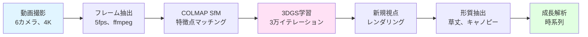

# 3DGS パイプライン マニュアル

**3D Gaussian Splatting（3DGS）を用いた時系列植物フェノタイピング**の総合マニュアルへようこそ。

{ width="100%" }
*動画撮影から形質抽出までの完全なパイプライン*

---

## 目的

このマニュアルでは、静岡大学峯野研究室で開発した3DGSベースの時系列植物フェノタイピングパイプラインを再現するための、完全なステップバイステップの手順を提供します。

!!! success "学習内容"
    - ✅ 完全な環境構築（CUDA、COLMAP、3DGS）
    - ✅ 動画処理とフレーム抽出
    - ✅ Structure-from-Motion（SfM）による三次元復元
    - ✅ 3D Gaussian Splattingの学習
    - ✅ 品質評価とレンダリング
    - ✅ 植物形質の抽出
    - ✅ 時系列成長解析

---

## クイックスタート

<div class="grid cards" markdown>

-   :material-rocket-launch:{ .lg .middle } **クイックスタート**

    ---

    30分で動作環境を構築

    [:octicons-arrow-right-24: 今すぐ始める](getting-started/quick-start.md)

-   :material-cog:{ .lg .middle } **環境構築**

    ---

    完全なインストールガイド

    [:octicons-arrow-right-24: インストール](environment/intro.md)

-   :material-play-circle:{ .lg .middle } **パイプライン実行**

    ---

    完全なワークフローを実行

    [:octicons-arrow-right-24: 実行する](pipeline/overview.md)

-   :material-book-open:{ .lg .middle } **研究内容**

    ---

    独自の貢献と結果

    [:octicons-arrow-right-24: 見る](my-research/overview.md)

</div>

---

## パイプライン概要



---

## 動画デモ

### パイプライン完全解説

<video controls width="100%" style="border-radius:8px; margin-bottom:1rem;">
  <source src="assets/videos/tutorials/pipeline-overview.mp4" type="video/mp4">
</video>

*動画1：動画撮影から形質抽出までのパイプライン実行の全体解説*

---

## システム要件

!!! info "推奨構成"
    **OS：** Ubuntu 22.04 LTS  
    **GPU：** NVIDIA RTX 6000 Ada（VRAM 48GB）または同等品  
    **CUDA：** 12.1以降  
    **RAM：** 64GB以上  
    **ストレージ：** 完全なデータセット用に2TB以上  

最小スペックは[詳細要件](getting-started/requirements.md)を参照してください。

---

## 主な成果

このパイプラインは以下を達成しています：

!!! success "性能指標"
    - **PSNR：** 23.84 ± 0.83 dB（再構成品質）
    - **時間的安定性：** CV = 3.5%（非常に高い一貫性）
    - **草丈抽出：** CV = 9.7%（スケール不変手法）
    - **改善率：** PLY手法比 44.7ポイント向上


*50日間にわたる22日分のデータで検証済み*

---

## ドキュメント構成

### 初心者向け
- **[はじめに](getting-started/overview.md)** - 概要と基本概念
- **[環境構築](environment/intro.md)** - 完全なインストールガイド
- **[クイックスタート](getting-started/quick-start.md)** - 30分で動作確認

### 実践ユーザー向け
- **[パイプライン実行](pipeline/overview.md)** - 完全なワークフローガイド
- **[パラメータ設定](parameters/recommended.md)** - 最適化のヒント
- **[トラブルシューティング](troubleshooting/common-issues.md)** - 問題解決

### 研究者向け
- **[研究内容](my-research/overview.md)** - 独自の貢献
- **[結果・検証](my-research/results.md)** - 完全な実験結果
- **[発表論文](my-research/publications.md)** - 論文とプレゼンテーション

---

## よくある使い方

=== "単一日付の処理"

    ```bash
    # 1つの日付を最初から最後まで処理
    ./scripts/run_single_date.sh 20260119
    ```

=== "複数日付の一括処理"

    ```bash
    # 複数の日付をバッチ処理
    ./scripts/run_batch.sh dates.txt
    ```

=== "形質抽出のみ"

    ```bash
    # 既存のモデルから形質を抽出
    python scripts/extract_traits.py --date 20260119
    ```

---

## サポート

!!! question "お困りですか？"
    
    **以下のリソースをご確認ください：**
    
    1. **[よくある問題](troubleshooting/common-issues.md)** - 既知の問題と解決策
    2. **[COLMAPエラー](troubleshooting/colmap-errors.md)** - COLMAP固有の問題
    3. **[GPU/メモリ](troubleshooting/gpu-memory.md)** - ハードウェアのトラブルシューティング
    
    **それでも解決しない場合：**
    
    お問い合わせ先：静岡大学 峯野研究室  
    メール：al.zobaer.24@shizuoka.ac.jp

---

## 謝辞

このパイプラインは、静岡大学峯野研究室における温室トマトのフェノタイピング研究の一環として開発されました。

**著者：** Zobaer Al（修士課程2年）  
**指導教員：** 峯野裕 教授  
**所属：** 静岡大学

---

## 引用

本パイプラインをご利用の場合は、以下の文献を引用してください：

```bibtex
@mastersthesis{al2026_3dgs_phenotyping,
  author = {Al, Zobaer},
  title = {3D Gaussian Splatting for Time-Series Greenhouse Tomato Plant Phenotyping},
  school = {Shizuoka University},
  year = {2026},
  type = {Master's Thesis}
}
```

---

**最終更新：** {{ git_revision_date_localized }}
