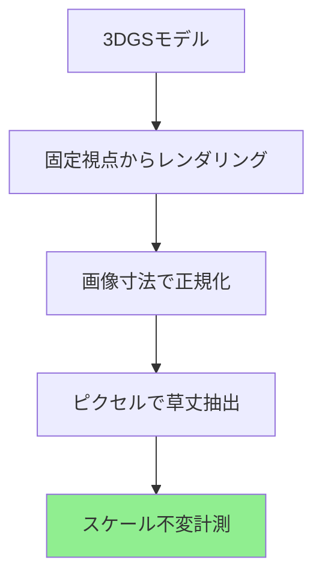

# 独自の研究貢献

3DGSベースの植物フェノタイピングにおける独自の貢献を記録します。

---

## 1. スケール不変草丈抽出

### 問題点

!!! warning "発見した課題"
    Structure-from-Motion（SfM）再構成は各撮影日に異なる座標スケールを生成するため、直接の草丈比較が不可能になります。

### 提案手法

**革新点：** 正規化画像空間でのレンダリング画像ベース計測。

!!! success "独自の貢献 #1"
    **複数日の3DGS再構成から植物フェノタイピングのためのスケール不変形質抽出の初実証。**
    
    - **手法：** 画像空間正規化
    - **結果：** CV 44.7ポイント改善（54.4% → 9.7%）
    - **検証：** 22日分、50日間

---

## 2. 環境相関解析

IoTセンサーによる以下のデータを統合：
- 気温（℃）
- 湿度（%）
- 日射量（W/m²）

!!! tip "独自の発見"
    **PSNRとの有意な湿度相関：**
    
    - 相関係数：r = +0.506
    - p値：p = 0.032（α=0.05で有意）
    - 解釈：高湿度 → 再構成品質の向上

!!! success "独自の貢献 #2"
    **3DGS品質に対する環境的影響の初確認。**

---

## 3. 50日間の完全検証

!!! success "独自の貢献 #3"
    **時系列植物フェノタイピングのための3DGSの長期検証。**
    
    - 期間：50日間
    - 頻度：22回の撮影日
    - 一貫性：CV = 3.5%（PSNR）
    - 成長追跡：正の相関（r = 0.209）

---

## 4. 完全なパイプライン統合

3DGSとIoTセンサーを統合したシステムアーキテクチャを構築しました。

---

## 貢献のまとめ

| 貢献 | 革新点 | インパクト | 検証 |
|-----|------|--------|---|
| **スケール不変計測** | 画像空間正規化 | CV 44.7ポイント改善 | 22日分、50日間 |
| **環境相関** | 湿度-PSNR関係 | 初の特定 | r=+0.506*, p=0.032 |
| **日射量分類** | データ駆動100 W/m²閾値 | WMO検証済み | n=9:9 |
| **長期検証** | 50日間連続モニタリング | 時間的一貫性 | CV = 3.5% |

---

**本ページに示す全ての結果は、静岡大学峯野研究室における Zobaer Al の独自の研究成果です。**
