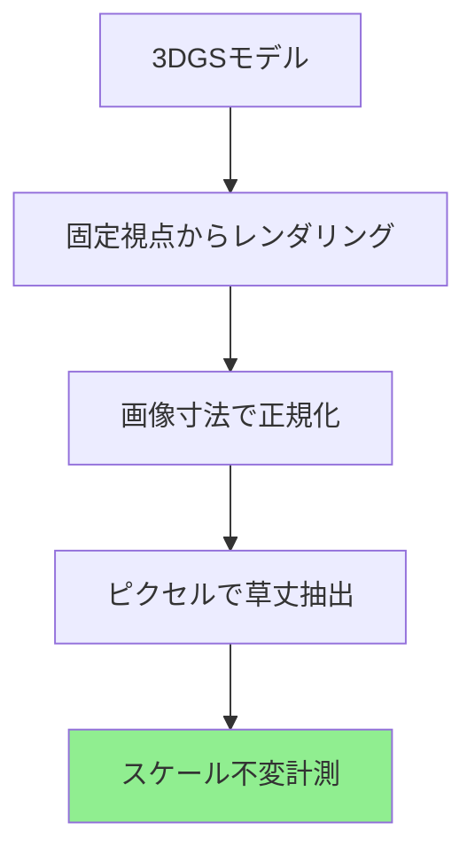

# 独自の研究貢献

3DGSベースの植物フェノタイピングにおける独自の貢献を記録します。

---

## 1. スケール不変草丈抽出

### 問題点

!!! warning "発見した課題"
    Structure-from-Motion（SfM）再構成は各撮影日に異なる座標スケールを生成するため、直接の草丈比較が不可能になります。

### 提案手法

**革新点：** 正規化画像空間でのレンダリング画像ベース形質抽出。絶対計測ではなく**相対的な生育モニタリング**に用います。

!!! success "独自の貢献 #1"
    **複数日の3DGS再構成から植物フェノタイピングのためのスケール不変形質抽出の初実証。**
    
    - **手法：** 画像空間正規化
    - **結果：** CV 18.2ポイント（2.86倍）改善（28.0% → 9.8%）
    - **検証：** 22日分、49日間
    - **意義：** 信頼できる時系列生育**モニタリング**を実現（絶対値ではなく相対変化）

!!! warning "較正は誤った対処"
    直接3D草丈にセッションごとのスケール係数を掛けると、かえって悪化します（CV 35.1% 対 28.0%）。推定スケール係数自体がノイズを持ち、独自の分散を持ち込むためです。これがレンダー空間で計測する動機です（レンダー空間ではスケールが原理的に相殺されます）。

### 生物学的検証 — 剪定イベント検出

レンダー空間の信号が単なる数値的安定性ではなく*実際の生物学的変化*を追跡している最も強い証拠は、記録された栽培管理イベントを検出できることです。

!!! success "生物学的検証"
    **記録された3件の剪定イベントが、いずれも草丈の急な低下として検出されました**（平均低下 ≈ 正規化草丈で0.20、15〜27ポイント。背景変動9.8%を大きく上回る）。

    - **有意性：** p = 0.0008（剪定日 対 非剪定日）
    - **意味：** 実際の管理イベントに反応するため、**モニタリング／変化検出**の信号として有用です。

### 物理基準による裏付け — 45cmパイプ

レンダー空間の草丈を物理的に基準づけるため、既知長（45cm）の場内ベンチパイプを、植物と同時に写る「ものさし」として用います。

基準草丈：**h_gt =（植物ピクセル / パイプピクセル）× 45 cm**、全22セッションで注釈付け。

!!! success "物理基準との一致"
    レンダー空間草丈は、全22セッションでパイプ比基準と相関します：

    - **ピアソン r = 0.74**（p < 0.001）、R² = 0.55
    - 基準平均草丈 159.9 cm、同程度のばらつき（h_gt CV 8.9% 対 h_norm CV 9.6%）
    - パイプは固定45cmに対し263〜420pxに広がるため、未説明分散の約45%は**基準器具側のノイズ**（セッション間のSfMスケール不定性）であり、パイプライン誤差ではありません。

!!! note "誠実なスコープ"
    r = 0.74 は信号が実スケールに**基づいている**ことの裏付けであり、**絶対精度の証明ではありません**。これらのセッションでは較正済みメジャーによるグラウンドトゥルース（RMSE）は取得していません。限界と今後の取得手順は[結果と検証](results.md#limitations-and-future-ground-truth)を参照してください。

---

## 2. 環境相関解析

IoTセンサーによる以下のデータを統合：
- 気温（℃）
- 湿度（%）
- 日射量（W/m²）

!!! tip "独自の発見"
    **PSNRとの有意な湿度相関：**
    
    - 相関係数：r = +0.506
    - p値：p = 0.032（α=0.05で有意）
    - 解釈：高湿度 → 再構成品質の向上

!!! success "独自の貢献 #2"
    **3DGS品質に対する環境的影響の初確認。**

---

## 3. 49日間の完全検証

!!! success "独自の貢献 #3"
    **時系列植物フェノタイピングのための3DGSの長期検証。**
    
    - 期間：49日間
    - 頻度：22回の撮影日
    - 一貫性：CV = 3.5%（PSNR）
    - 成長追跡：正の相関（r = 0.209）

---

## 4. 完全なパイプライン統合

3DGSとIoTセンサーを統合したシステムアーキテクチャを構築しました。

---

## 貢献のまとめ

| 貢献 | 革新点 | インパクト | 検証 |
|-----|------|--------|---|
| **スケール不変レンダー空間モニタリング** | 画像空間正規化 | CV 18.2ポイント（2.86倍）改善 | 22日分、49日間 |
| **剪定イベント検出** | レンダー空間形質からの変化検出 | 生物学的検証 | 3件、p = 0.0008 |
| **物理基準による裏付け** | 場内45cmパイプ比 | 実スケールとの整合 | r = 0.74, p < 0.001 |
| **環境相関** | 湿度-PSNR関係 | 初の特定 | r=+0.506*, p=0.032 |
| **日射量分類** | データ駆動100 W/m²閾値 | WMO検証済み | n=9:9 |
| **長期検証** | 49日間連続モニタリング | 時間的一貫性 | CV = 3.5% |

---

**本ページに示す全ての結果は、静岡大学峯野研究室における Zobaer Al の独自の研究成果です。**
