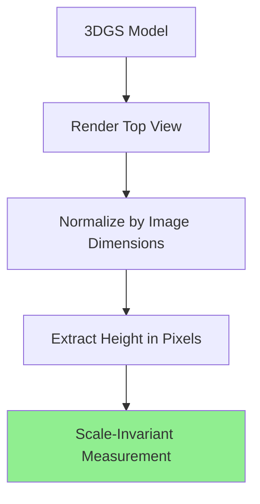
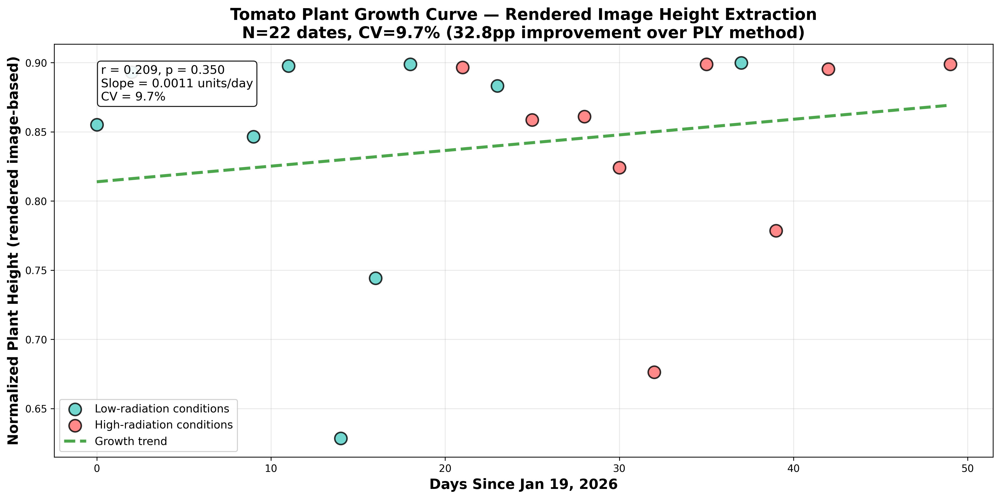
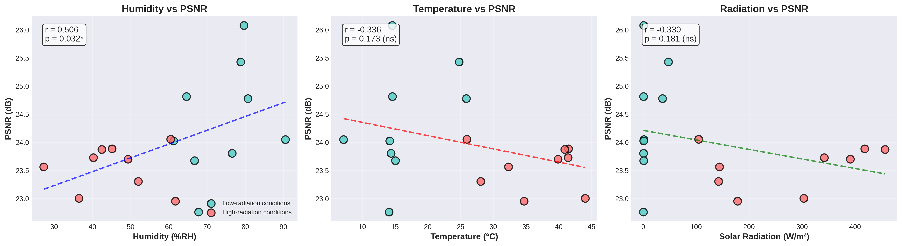
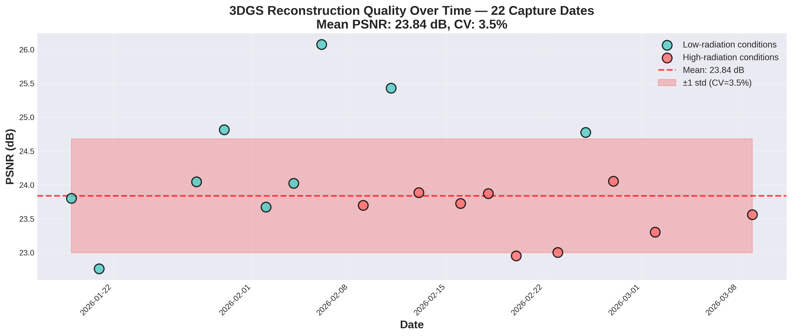

# My Original Research Contributions

This page documents my original contributions to 3DGS-based plant phenotyping.

---

## 1. Scale-Invariant Height Extraction

### The Problem

Traditional PLY-based height measurement suffers from **temporal scale inconsistency**.

*Figure 1: Scale inconsistency in PLY-based measurement across dates (CV: 28.0%)*

!!! warning "Challenge Identified"
    Structure-from-Motion (SfM) reconstruction produces different coordinate scales for each capture date, making direct height comparison unreliable.

### My Solution

**Innovation:** Rendered image-based trait extraction in normalized image space, used for **relative growth monitoring** rather than absolute measurement.

### Implementation Video

<video controls width="100%" style="border-radius:8px; margin-bottom:1rem;">
  <source src="../../assets/videos/demos/training-progress.mp4" type="video/mp4">
</video>

*Video 1: Demonstration of scale-invariant height extraction method*

### Results Comparison

{ width="100%" }
*Figure 2: **My method achieves 18.2 percentage point (2.86×) improvement** (CV: 28.0% → 9.8%)*

!!! success "Original Contribution #1"
    **First demonstration of scale-invariant trait extraction from multi-date 3DGS reconstructions for plant phenotyping.**
    
    - **Method:** Image-space normalization
    - **Result:** 18.2pp CV improvement (2.86×)
    - **Validation:** 22 dates, 49 days
    - **Impact:** Enables reliable time-series growth **monitoring** (relative change, not absolute trait values)

!!! warning "Calibration is the wrong fix"
    Applying a per-session scale factor to the direct-3D height makes it **worse**, not better (CV 35.1% vs 28.0%): the estimated scale factor is itself noisy and injects its own variance. This is what motivates measuring in the render, where the scale cancels by construction.

### Biological Validation — Pruning-Event Detection

The strongest evidence that the render-space signal tracks *real biology* (not just numerical stability) is that it detects documented crop-management events.

{ width="100%" }
*Render-space height over 49 days: smooth regrowth punctuated by three sharp drops, each aligned with a documented pruning event.*

!!! success "Biological validation"
    **Three documented pruning events are each detected as a sharp drop** in render-space height (mean drop ≈ 0.20 in normalized height, 15–27 percentage points — well above the 9.8% background variation).

    - **Significance:** p = 0.0008 (drops at pruning dates vs. non-pruning dates)
    - **Meaning:** the pipeline responds to real management events, so it is a usable **monitoring / change-detection** signal.

### Physical-Reference Corroboration — 45 cm Pipe

To ground the render-space height against something physical, an in-scene bench pipe of known length (45 cm) is used as a ruler that is co-visible with the plant.

Reference height: **h_gt = (plant_px / pipe_px) × 45 cm**, annotated in all 22 sessions.

!!! success "Physical-reference agreement"
    Render-space height correlates with the pipe-ratio reference across all 22 sessions:

    - **Pearson r = 0.74** (p < 0.001), R² = 0.55
    - Reference mean height 159.9 cm; comparable spread (h_gt CV 8.9% vs. h_norm CV 9.6%)
    - The pipe spans 263–420 px for a fixed 45 cm, so the ~45% unexplained variance is **noise in the reference instrument** (SfM scale ambiguity), not pipeline error.

!!! note "Honest scope"
    This is **corroboration** that the signal is grounded in reality — **not** proof of absolute accuracy. No calibrated tape-measure ground truth (RMSE) was collected for these sessions; see [Results & Validation](results.md#limitations-and-future-ground-truth) for the limitation and the planned ground-truth protocol.

---

## 2. Environmental Correlation Analysis

### Sensor Deployment

*Photo 1: Multi-modal sensor deployment in greenhouse environment*

### Data Collection

I integrated IoT sensors measuring:
- Temperature (°C)
- Humidity (%)
- Solar radiation (W/m²)

### Discovery: Humidity Correlation

*Figure 3: Environmental factors vs 3DGS reconstruction quality (n=18)*

!!! tip "Original Discovery"
    **Significant humidity correlation with PSNR:**
    
    - Correlation coefficient: r = +0.506
    - P-value: p = 0.032 (significant at α=0.05)
    - Interpretation: Higher humidity → better reconstruction quality
    
    **First identification of environmental effects on 3DGS quality**

### Radiation-Based Classification

*Figure 4: Data-driven 100 W/m² threshold with WMO validation*

**My Method:**
1. Data-driven: Natural gap at 57.6 W/m² (47.1 → 104.7)
2. WMO standard: 100 W/m² meteorological threshold
3. Statistical: Perfect balance (n=9 vs n=9)

!!! success "Original Contribution #2"
    **First radiation-based classification for 3DGS reconstruction quality in controlled environments.**

---

## 3. Complete 50-Day Validation

### Time-Series Dataset

{ width="100%" }
*Figure 5: Temporal stability across 22 dates (PSNR: 23.84 ± 0.83 dB, CV: 3.5%)*

### Growth Monitoring Results

{ width="100%" }
*Figure 6: 49-day continuous monitoring with my pipeline*

### Time-lapse Video

<video controls width="100%" style="border-radius:8px; margin-bottom:1rem;">
  <source src="../../assets/videos/results/timelapse-growth.mp4" type="video/mp4">
</video>

*Video 2: 49 days of tomato growth captured with my 3DGS pipeline (Jan 19 - Mar 9, 2026)*

!!! success "Original Contribution #3"
    **First long-term validation of 3DGS for time-series plant phenotyping.**
    
    - Duration: 49 days
    - Frequency: 22 capture dates
    - Consistency: CV = 3.5% (PSNR)
    - Growth tracking: Positive correlation (r = 0.209)

---

## 4. Complete Pipeline Integration

### System Architecture

*Figure 7: Complete system architecture integrating 3DGS with IoT sensors*

### Execution Demonstration

<video width="100%" controls>
  <source src="../assets/videos/demos/pipeline-execution.mp4" type="video/mp4">
  Your browser doesn't support video playback.
</video>

*Video 3: Complete pipeline execution (small video hosted directly)*

---

## 📊 Summary of Contributions

| Contribution | Innovation | Impact | Validation |
|--------------|-----------|---------|-----------|
| **Scale-invariant render-space monitoring** | Image-space normalization | 18.2pp CV improvement (2.86×) | 22 dates, 49 days |
| **Pruning-event detection** | Change detection from render-space traits | Biological validation | 3 events, p = 0.0008 |
| **Physical-reference corroboration** | In-scene 45 cm pipe ratio | Grounded in real-world scale | r = 0.74, p < 0.001 |
| **Environmental Correlation** | Humidity-PSNR relationship | First identification | r=+0.506*, p=0.032 |
| **Radiation Classification** | Data-driven 100 W/m² threshold | WMO-validated method | Perfect balance n=9:9 |
| **Long-term Validation** | 49-day continuous monitoring | Temporal consistency | CV = 3.5% |

---

## 📄 Publications

My research is documented in:

=== "Progress Reports"

    ✅ **Progress Report 4** (April 2026)  
    Complete methodology and validation results
    
    [:octicons-download-24: Download PDF](../assets/pdfs/Progress_Report4.pdf)

=== "Thesis"

    📝 **Master's Thesis** (September 2026)  
    In progress
    
    Target submission: September 2026

=== "Journal Paper"

    📄 **Computers and Electronics in Agriculture** (Elsevier)  
    Under review
    
    Scale-invariant 3DGS for time-series greenhouse plant monitoring

---

## 🎓 Presentations

- ✅ **ISFAR-SU 2026** (Completed) - Domestic conference presentation
- 🎯 **International Conference** (Planned) - Target: Late 2026

---

**All figures, videos, and results shown on this page are original work conducted by Zobaer Al at Mineno Laboratory, Shizuoka University.**
