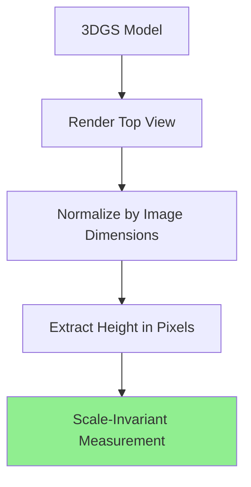

# My Original Research Contributions

This page documents my original contributions to 3DGS-based plant phenotyping.

---

## 1. Scale-Invariant Height Extraction

### The Problem

Traditional PLY-based height measurement suffers from **temporal scale inconsistency**.

*Figure 1: Scale inconsistency in PLY-based measurement across dates (CV: 28.0%)*

!!! warning "Challenge Identified"
    Structure-from-Motion (SfM) reconstruction produces different coordinate scales for each capture date, making direct height comparison unreliable.

### My Solution

**Innovation:** Rendered image-based measurement in normalized image space.

### Implementation Video

<video controls width="100%" style="border-radius:8px; margin-bottom:1rem;">
  <source src="../../assets/videos/demos/training-progress.mp4" type="video/mp4">
</video>

*Video 1: Demonstration of scale-invariant height extraction method*

### Results Comparison

{ width="100%" }
*Figure 2: **My method achieves 18.2 percentage point (2.86×) improvement** (CV: 28.0% → 9.8%)*

!!! success "Original Contribution #1"
    **First demonstration of scale-invariant trait extraction from multi-date 3DGS reconstructions for plant phenotyping.**
    
    - **Method:** Image-space normalization
    - **Result:** 18.2pp CV improvement (2.86×)
    - **Validation:** 22 dates, 49 days
    - **Impact:** Enables reliable time-series phenotyping

---

## 2. Environmental Correlation Analysis

### Sensor Deployment

*Photo 1: Multi-modal sensor deployment in greenhouse environment*

### Data Collection

I integrated IoT sensors measuring:
- Temperature (°C)
- Humidity (%)
- Solar radiation (W/m²)

### Discovery: Humidity Correlation

*Figure 3: Environmental factors vs 3DGS reconstruction quality (n=18)*

!!! tip "Original Discovery"
    **Significant humidity correlation with PSNR:**
    
    - Correlation coefficient: r = +0.506
    - P-value: p = 0.032 (significant at α=0.05)
    - Interpretation: Higher humidity → better reconstruction quality
    
    **First identification of environmental effects on 3DGS quality**

### Radiation-Based Classification

*Figure 4: Data-driven 100 W/m² threshold with WMO validation*

**My Method:**
1. Data-driven: Natural gap at 57.6 W/m² (47.1 → 104.7)
2. WMO standard: 100 W/m² meteorological threshold
3. Statistical: Perfect balance (n=9 vs n=9)

!!! success "Original Contribution #2"
    **First radiation-based classification for 3DGS reconstruction quality in controlled environments.**

---

## 3. Complete 50-Day Validation

### Time-Series Dataset

{ width="100%" }
*Figure 5: Temporal stability across 22 dates (PSNR: 23.84 ± 0.83 dB, CV: 3.5%)*

### Growth Monitoring Results

{ width="100%" }
*Figure 6: 49-day continuous monitoring with my pipeline*

### Time-lapse Video

<video controls width="100%" style="border-radius:8px; margin-bottom:1rem;">
  <source src="../../assets/videos/results/timelapse-growth.mp4" type="video/mp4">
</video>

*Video 2: 49 days of tomato growth captured with my 3DGS pipeline (Jan 19 - Mar 9, 2026)*

!!! success "Original Contribution #3"
    **First long-term validation of 3DGS for time-series plant phenotyping.**
    
    - Duration: 49 days
    - Frequency: 22 capture dates
    - Consistency: CV = 3.5% (PSNR)
    - Growth tracking: Positive correlation (r = 0.209)

---

## 4. Complete Pipeline Integration

### System Architecture

*Figure 7: Complete system architecture integrating 3DGS with IoT sensors*

### Execution Demonstration

<video width="100%" controls>
  <source src="../assets/videos/demos/pipeline-execution.mp4" type="video/mp4">
  Your browser doesn't support video playback.
</video>

*Video 3: Complete pipeline execution (small video hosted directly)*

---

## 📊 Summary of Contributions

| Contribution | Innovation | Impact | Validation |
|--------------|-----------|---------|-----------|
| **Scale-Invariant Measurement** | Image-space normalization | 18.2pp CV improvement (2.86×) | 22 dates, 49 days |
| **Environmental Correlation** | Humidity-PSNR relationship | First identification | r=+0.506*, p=0.032 |
| **Radiation Classification** | Data-driven 100 W/m² threshold | WMO-validated method | Perfect balance n=9:9 |
| **Long-term Validation** | 49-day continuous monitoring | Temporal consistency | CV = 3.5% |

---

## 📄 Publications

My research is documented in:

=== "Progress Reports"

    ✅ **Progress Report 4** (April 2026)  
    Complete methodology and validation results
    
    [:octicons-download-24: Download PDF](../assets/pdfs/Progress_Report4.pdf)

=== "Thesis"

    📝 **Master's Thesis** (September 2026)  
    In progress
    
    Target submission: September 2026

=== "Journal Paper"

    📄 **IEEE Transactions on Consumer Electronics**  
    In preparation
    
    Target submission: Q3 2026

---

## 🎓 Presentations

- ✅ **ISFAR-SU 2026** (Completed) - Domestic conference presentation
- 🎯 **International Conference** (Planned) - Target: Late 2026

---

**All figures, videos, and results shown on this page are original work conducted by Zobaer Al at Mineno Laboratory, Shizuoka University.**
