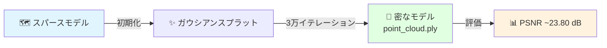

# Stage 3：3DGS学習

COLMAPのスパース再構成から3D Gaussian Splattingモデルを学習します。

---

## このステージの概要



**推定所要時間：** 18〜30分（RTX 6000 Ada）

---

## 学習コマンド

```bash
conda activate 3dgs
export PYTORCH_CUDA_ALLOC_CONF=expandable_segments:True

python train.py \
    -s /path/to/date_20260119 \
    -m /path/to/date_20260119/output \
    --iterations 30000
```

!!! info "`-s` と `-m` の意味"
    - `-s`：`frames/` と `sparse/` を含むデータセットルートフォルダ
    - `-m`：学習済みモデルの保存先

---

## 学習の監視

ターミナルが100イテレーションごとに指標を表示します：

```
[24000/30000] L1 loss=0.0183 | PSNR=23.42 | Gaussians=1,234,567
[30000/30000] L1 loss=0.0175 | PSNR=23.80 | Gaussians=1,287,441
```

| 指標 | 意味 | 目標値 |
|-----|-----|------|
| `L1 loss` | 測光誤差 | 減少傾向 → 0.02未満 |
| `PSNR` | 再構成品質 | 23 dB以上 |
| `Gaussians` | 三次元スプラット数 | 通常100〜200万 |

---

## 学習の進行フェーズ

| イテレーション | 変化 | 視覚的結果 |
|---------|-----|--------|
| 0 – 500 | 点群の初期化 | 非常にまばら |
| 500 – 5,000 | 急速な密化 | 植物の形が現れる |
| 5,000 – 15,000 | 精細化 | 葉と茎が明確に |
| 15,000 – 30,000 | 微調整 | テクスチャの細部が鮮明に |

---

## 出力の確認

```bash
ls -lh output/point_cloud/iteration_30000/point_cloud.ply
```

!!! success "合格基準"
    - ✅ `point_cloud.ply` が存在
    - ✅ ファイルサイズ：100〜400 MB
    - ✅ 最終PSNR ≥ 22 dB
    - ✅ CUDA OOMエラーなし

---

## 次のステップ

[→ Stage 4：レンダリング](rendering.md){ .md-button .md-button--primary }
