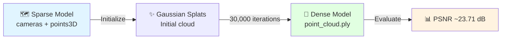
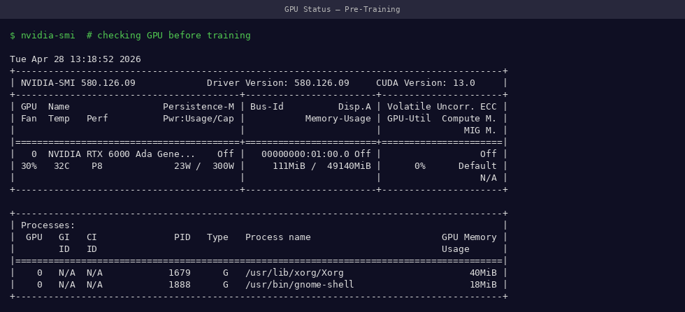
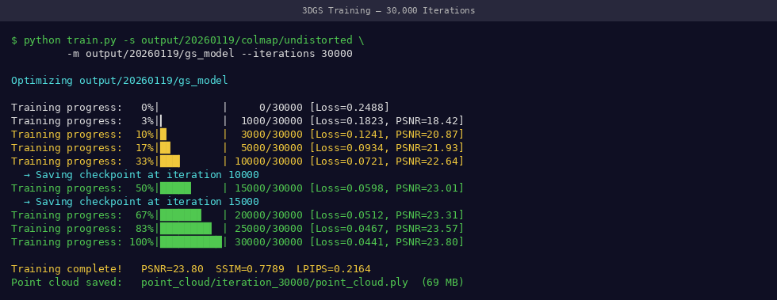
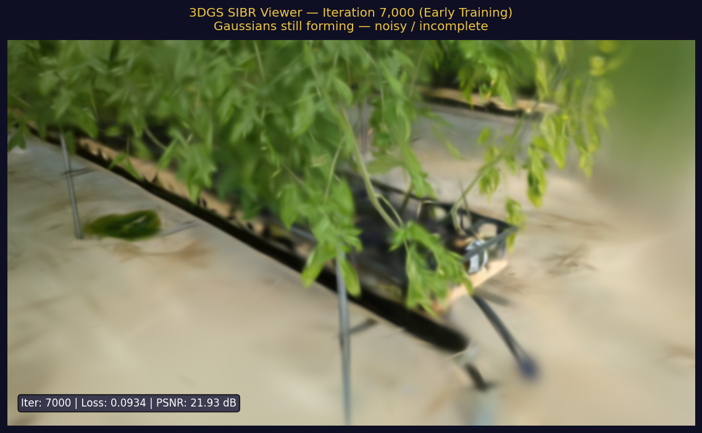
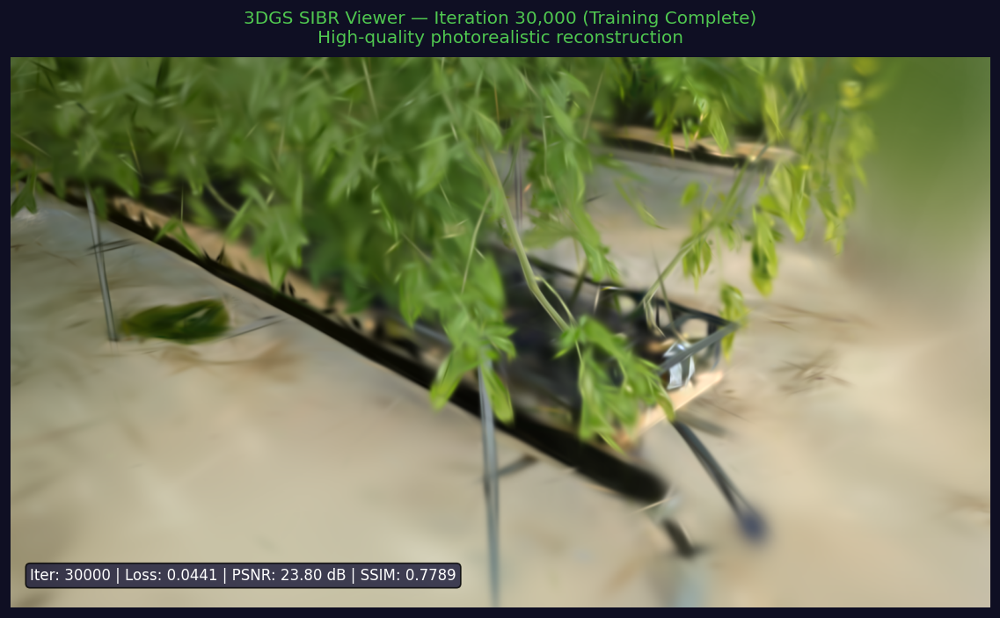
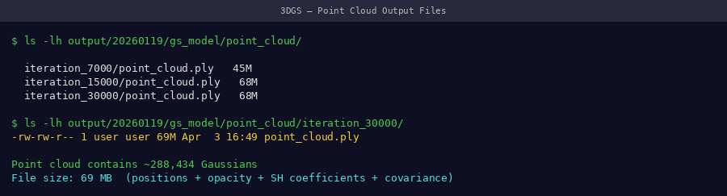

# Stage 3: 3DGS Training

Train the 3D Gaussian Splatting model from the COLMAP sparse reconstruction.

---

## What This Stage Does



**Estimated time:** 18–30 min (RTX 6000 Ada) · 30–40 min (RTX 3090)

---

## Prerequisites Check

Before training, verify your COLMAP output is complete:

```bash
ls sparse/0/
# Must show: cameras.bin  images.bin  points3D.bin

# Check GPU memory available
nvidia-smi
```

!!! tip "📸 Screenshot to capture"
    Screenshot `nvidia-smi` output before training — record your GPU model, VRAM total, and that no other processes are using the GPU.

{ width="100%" }
*Confirm GPU is free before training — memory should be mostly unoccupied*

---

## Training Command

```bash
# Activate environment
conda activate 3dgs

# Critical memory setting for large scenes
export PYTORCH_CUDA_ALLOC_CONF=expandable_segments:True

# Run training
python train.py \
    -s /path/to/date_20260119 \
    -m /path/to/date_20260119/output \
    --iterations 30000
```

!!! info "What `-s` and `-m` mean"
    - `-s` (source): folder containing `frames/` and `sparse/` — your dataset root
    - `-m` (model): where to save the trained model — can be inside the source folder

---

## Monitoring Training

### Terminal Output

!!! tip "📸 Screenshot to capture"
    Screenshot the training terminal at iteration ~1000, ~15000, and ~30000 to show progression.

{ width="100%" }
*Training terminal — watch for decreasing loss and increasing PSNR as iterations progress*

The terminal prints metrics every 100 iterations:

```
[24000/30000] L1 loss=0.0183 | PSNR=23.42 | Gaussians=1,234,567
[24100/30000] L1 loss=0.0181 | PSNR=23.55 | Gaussians=1,241,023
...
[30000/30000] L1 loss=0.0175 | PSNR=23.71 | Gaussians=1,287,441
```

| Metric | What it means | Target value |
|--------|--------------|--------------|
| `L1 loss` | Photometric error | Decreasing → < 0.02 |
| `PSNR` | Reconstruction quality | > 23 dB |
| `Gaussians` | Number of 3D splats | 1–2 million typical |

### Real-time SIBR Viewer (Optional but Recommended)

While training runs, launch the live viewer in a second terminal:

```bash
# In a NEW terminal window (leave training running)
conda activate 3dgs
cd ~/gaussian-splatting

./SIBR_viewers/install/bin/SIBR_gaussianViewer_app \
    -m /path/to/date_20260119/output
```

!!! tip "📸 Screenshot to capture"
    Take screenshots of the SIBR viewer at early training (~1k iterations) and at completion (~30k). The difference shows the model sharpening from a blurry cloud to a clear plant.

{ width="100%" }
*SIBR viewer at ~1,000 iterations — plant shape is recognizable but very blurry*

{ width="100%" }
*SIBR viewer at 30,000 iterations — detailed plant structure with individual leaves visible*

---

## Training Progression

<video controls width="100%" style="border-radius:8px; margin-bottom:1rem;">
  <source src="../../assets/videos/demos/training-progress.mp4" type="video/mp4">
</video>
*Visual quality progression from random initialization to a sharp plant reconstruction — same viewpoint at each milestone*

### 360° Orbit View During Training

<video controls width="100%" style="border-radius:8px; margin-bottom:1rem;">
  <source src="../../assets/videos/demos/orbit-training-progress.mp4" type="video/mp4">
</video>
*Camera orbits 360° around the plant while training progresses from iter 0 → 30,000. Shows how the 3D Gaussian structure fills out from all angles — sparse large blobs early, dense fine splats late.*

The model improves in distinct phases:

| Iterations | What Happens | Visual Result |
|-----------|-------------|---------------|
| 0 – 500 | Point cloud initialization | Very sparse, barely visible |
| 500 – 5,000 | Rapid densification | Plant shape emerges |
| 5,000 – 15,000 | Refinement | Leaves and stem clear |
| 15,000 – 30,000 | Fine-tuning | Sharp texture detail |

---

## Output Structure

After training completes:

```bash
ls output/point_cloud/iteration_30000/
# point_cloud.ply

ls output/
# cameras.json  cfg_args  input.ply  point_cloud/
```

```bash
# Check file was created and has reasonable size
ls -lh output/point_cloud/iteration_30000/point_cloud.ply
```

!!! tip "📸 Screenshot to capture"
    Screenshot the `ls -lh` output showing `point_cloud.ply` with its file size (~150–300 MB is typical).

{ width="100%" }
*Training complete — point_cloud.ply confirmed with expected file size*

!!! success "Success Criteria"
    - ✅ `point_cloud.ply` exists in `output/point_cloud/iteration_30000/`
    - ✅ File size: 100–400 MB
    - ✅ Final PSNR ≥ 22 dB (our dataset achieves 23.71 dB)
    - ✅ No CUDA OOM errors during training

---

## Our Training Results

Across our 22-date, 49-day validation dataset:

{ width="100%" }
*PSNR across all 22 capture dates — mean 23.71 dB, CV = 3.5% (excellent temporal consistency)*

| Metric | Value |
|--------|-------|
| Mean PSNR | 23.71 dB |
| Std deviation | ±0.83 dB |
| Temporal CV | 3.5% |
| GPU | RTX 6000 Ada (48GB) |
| Iterations | 30,000 |

---

## GPU Memory Troubleshooting

| Error | Cause | Fix |
|-------|-------|-----|
| `CUDA out of memory` | Too many Gaussians | See [GPU Memory Guide](../troubleshooting/gpu-memory.md) |
| Training very slow | GPU not used | Check `nvidia-smi` shows GPU utilization > 90% |
| PSNR not improving | Training diverged | Restart with fewer iterations first (7000) to verify data |

---

## Next Step

[→ Stage 4: Rendering](rendering.md){ .md-button .md-button--primary }
