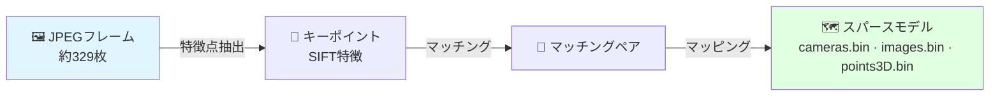

# Stage 2：COLMAP Structure-from-Motion

抽出したフレームからカメラ姿勢とスパース三次元点群を再構成します。

---

## このステージの概要



**推定所要時間：** 約30分

---

## ディレクトリの準備

```bash
mkdir -p date_20260119/sparse
cd date_20260119/
```

---

## Step 1：特徴点抽出

```bash
colmap feature_extractor \
    --database_path database.db \
    --image_path frames/ \
    --ImageReader.single_camera 1 \
    --ImageReader.camera_model PINHOLE \
    --SiftExtraction.use_gpu 1
```

!!! success "期待される出力"
    ```
    Processed file [1/329]
    ...
    Processed file [329/329]
    ```

---

## Step 2：特徴点マッチング

```bash
colmap exhaustive_matcher \
    --database_path database.db \
    --SiftMatching.use_gpu 1
```

!!! info "なぜ exhaustive マッチングか？"
    植物を1周する約329フレームでは、exhaustiveマッチングが全フレームペアを確認し、より堅牢なカメラ登録が得られます。

---

## Step 3：スパースマッピング

```bash
colmap mapper \
    --database_path database.db \
    --image_path frames/ \
    --output_path sparse/ \
    --Mapper.ba_global_max_num_iterations 20
```

!!! success "良好な登録の指標"
    ```
    => Registered:  329/329
    => Mean re-projection error: 0.87px
    ```

!!! warning "登録率が低い場合（フレームの80%未満）"
    [COLMAPエラー](../troubleshooting/colmap-errors.md)を参照

---

## 出力ファイルの確認

```bash
ls sparse/0/
# cameras.bin   images.bin   points3D.bin
```

| ファイル | 典型的なサイズ |
|------|---------|
| `cameras.bin` | 約1 KB |
| `images.bin` | 約200 KB |
| `points3D.bin` | 約20〜50 MB |

!!! danger "points3D.bin が非常に小さい場合（1MB未満）"
    再構成が失敗しています。フレーム品質を確認してください。

---

## 次のステップ

[→ Stage 3：3DGS学習](3dgs-training.md){ .md-button .md-button--primary }
