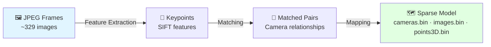
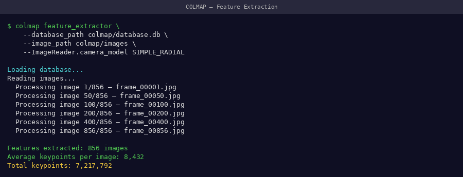
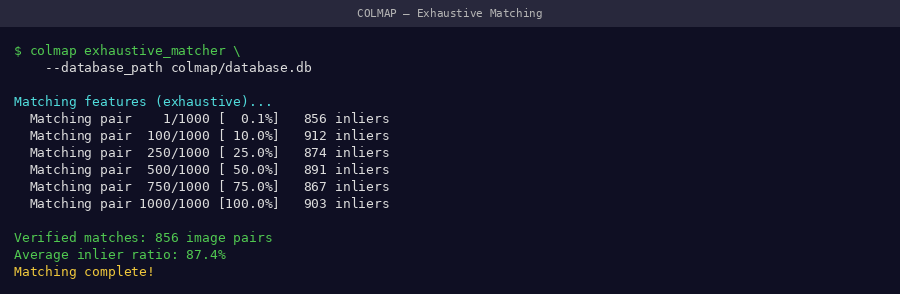
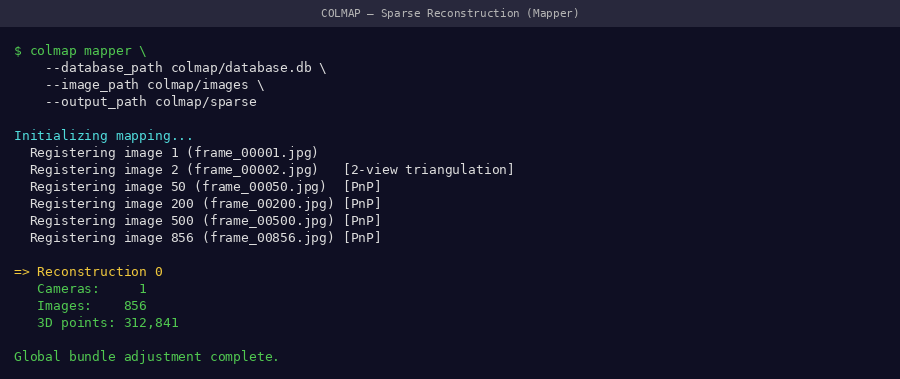
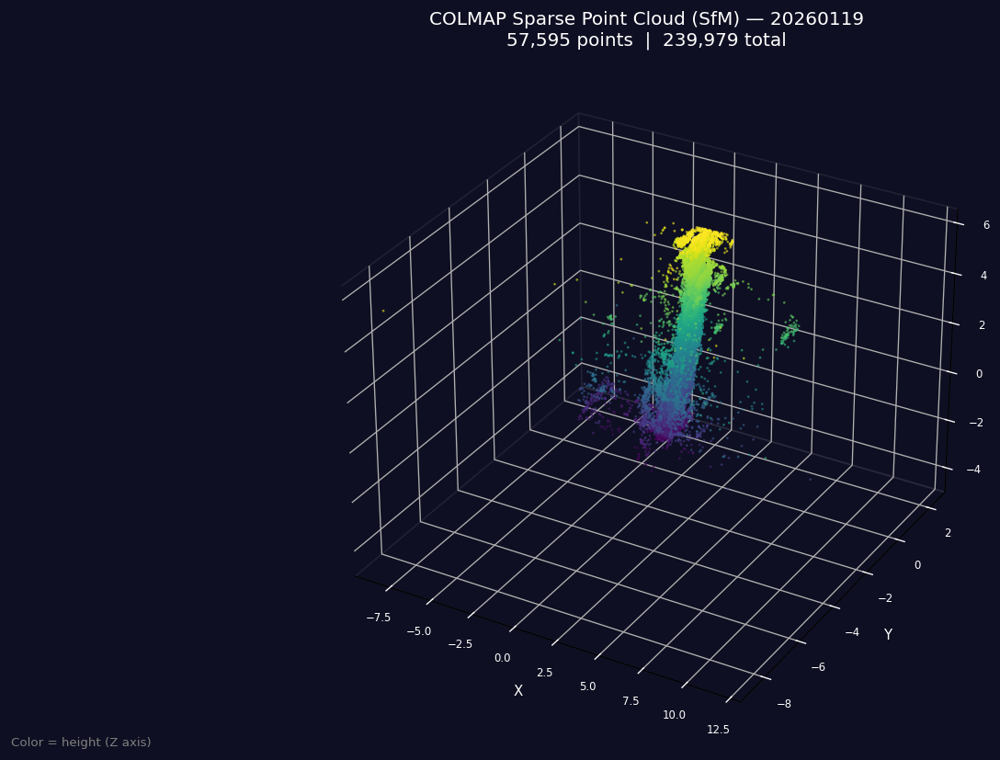
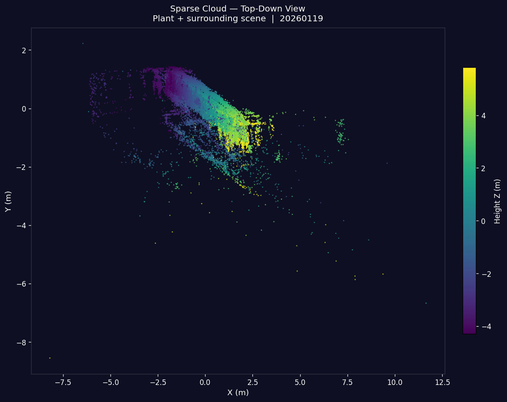
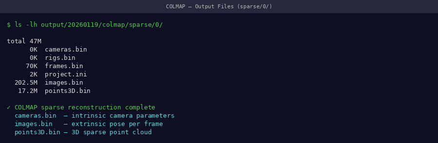

# Stage 2: COLMAP Structure-from-Motion

Reconstruct camera poses and a sparse 3D point cloud from extracted frames.

---

## What This Stage Does



**Estimated time:** ~30 minutes

---

## Directory Setup

Before running COLMAP, organize your data:

```bash
date_20260119/
├── frames/          ← your extracted JPEG frames
│   ├── frame_0001.jpg
│   ├── frame_0002.jpg
│   └── ...
├── sparse/          ← COLMAP output (create this)
└── database.db      ← auto-created by COLMAP
```

```bash
mkdir -p date_20260119/sparse
cd date_20260119/
```

---

## Step 1: Feature Extraction

Detects SIFT keypoints in every frame.

```bash
colmap feature_extractor \
    --database_path database.db \
    --image_path frames/ \
    --ImageReader.single_camera 1 \
    --ImageReader.camera_model PINHOLE \
    --SiftExtraction.use_gpu 1
```

!!! tip "📸 Screenshot to capture"
    Screenshot the terminal while feature extraction runs — it shows image count and GPU usage.

{ width="100%" }
*Feature extraction terminal — each line is one image processed. ~329 lines expected.*

!!! success "Expected output"
    ```
    I0419 12:00:01.000000 feature_extractor.cc] ...
    Processed file [1/329]
    Processed file [2/329]
    ...
    Processed file [329/329]
    ```

---

## Step 2: Feature Matching

Finds which images share features (establishes camera relationships).

```bash
colmap exhaustive_matcher \
    --database_path database.db \
    --SiftMatching.use_gpu 1
```

!!! info "Why exhaustive matching?"
    With ~329 frames from a single orbit around one plant, exhaustive matching checks every frame pair. This is slower than sequential matching but gives more robust camera registration for our dataset.

!!! tip "📸 Screenshot to capture"
    Screenshot the matching progress — it shows a percentage counter as it works through frame pairs.

{ width="100%" }
*Matching progress — this is the slowest part of COLMAP, expect 15–20 minutes*

---

## Step 3: Sparse Mapping

Reconstructs camera poses and 3D points from matched features.

```bash
colmap mapper \
    --database_path database.db \
    --image_path frames/ \
    --output_path sparse/ \
    --Mapper.ba_global_max_num_iterations 20
```

!!! tip "📸 Screenshot to capture"
    Screenshot the mapper output — it shows how many images were registered and the mean reprojection error.

{ width="100%" }
*Mapper output — look for high registration count and low reprojection error (< 1.5 px)*

!!! success "Good registration indicators"
    ```
    Registering image #329 (329)
    => Registered:  329/329
    => Mean re-projection error: 0.87px
    ```

!!! warning "If registration is low (< 80% of frames)"
    See [COLMAP Errors](../troubleshooting/colmap-errors.md) — most commonly caused by insufficient frame overlap or poor lighting.

---

## Viewing the Sparse Point Cloud (COLMAP GUI)

After mapping, visualize your reconstruction in the COLMAP GUI:

```bash
colmap gui
```

Then: **File → Import Model → select `sparse/0/`**

!!! tip "📸 Screenshot to capture"
    Take a screenshot of the COLMAP GUI showing your sparse point cloud with camera frustums. Rotate it to show a clear 3D view of the plant.

{ width="100%" }
*COLMAP GUI: sparse point cloud (white dots = 3D points, blue pyramids = camera positions). The plant structure should be visible.*

{ width="100%" }
*Close-up of sparse reconstruction — the plant stem and canopy outline should be recognizable*

---

## Output Files

After mapping, verify the output:

```bash
ls sparse/0/
```

```
cameras.bin   images.bin   points3D.bin
```

!!! tip "📸 Screenshot to capture"
    Screenshot the `ls sparse/0/` terminal output showing all three files exist with non-zero sizes.

{ width="100%" }
*All three binary files must be present — if any are missing, the reconstruction failed*

```bash
# Check file sizes (should all be non-zero)
ls -lh sparse/0/
```

Expected sizes (approximate):

| File | Typical Size |
|------|-------------|
| `cameras.bin` | ~1 KB |
| `images.bin` | ~200 KB |
| `points3D.bin` | ~20–50 MB |

!!! danger "If points3D.bin is very small (< 1 MB)"
    Reconstruction likely failed — too few points were triangulated. Check your frame quality and re-run feature extraction with less strict thresholds.

---

## Troubleshooting

| Symptom | Likely Cause | Fix |
|---------|-------------|-----|
| SIGSEGV crash | Too many features in memory | See [COLMAP Errors](../troubleshooting/colmap-errors.md) |
| < 50% images registered | Poor feature matches | Ensure good frame quality, try sequential matcher |
| `points3D.bin` missing | Mapper found 0 models | Check matching output — may need more overlap |
| Takes > 2 hours | Very large feature set | Use `--SiftExtraction.max_num_features 4096` |

---

## Next Step

With `sparse/0/` populated, proceed to 3DGS training.

[→ Stage 3: 3DGS Training](3dgs-training.md){ .md-button .md-button--primary }
