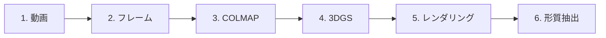

# パイプライン概要

3DGSパイプラインの完全なワークフロー。

---

## 処理ステージ

---

## ステージ詳細

| ステージ | 入力 | 出力 | 所要時間 |
|--------|-----|-----|------|
| 1. 動画処理 | MP4 | フレーム（JPG） | 1分 |
| 2. COLMAP SfM | フレーム | スパースモデル | 30分 |
| 3. 3DGS学習 | COLMAP | 点群 | 20分 |
| 4. レンダリング | 点群 | 画像 | 5分 |
| 5. 形質抽出 | 画像 | 計測値 | 2分 |

**合計：** 1日付あたり約1時間

---

次：[動画処理](video-processing.md)
