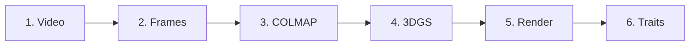

# Pipeline Overview

Complete 3DGS pipeline workflow.

## Stages



## Stage Details

| Stage | Input | Output | Time |
|-------|-------|--------|------|
| 1. Video Processing | MP4 | Frames (JPG) | 1 min |
| 2. COLMAP SfM | Frames | Sparse model | 30 min |
| 3. 3DGS Training | COLMAP | Point cloud | 20 min |
| 4. Rendering | Point cloud | Images | 5 min |
| 5. Trait Extraction | Images | Measurements | 2 min |

**Total:** ~1 hour per date

## Quick Execution

```bash
# See individual stage pages for details
```

Next: [Video Processing](video-processing.md)
