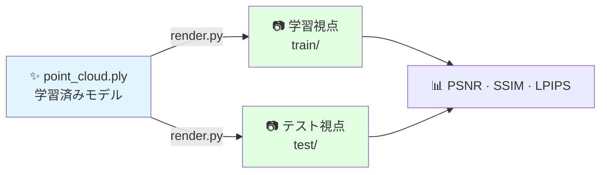

# Stage 4：レンダリング

学習済み3DGSモデルから新規視点画像を生成します。

---

## このステージの概要



**推定所要時間：** 約5分

---

## コマンド

```bash
conda activate 3dgs

python render.py \
    -m /path/to/date_20260119/output \
    --iteration 30000
```

---

## 期待されるターミナル出力

```
Loading trained model at iteration 30000
Rendering train views: 100%|████████| 263/263 [03:12<00:00]
Rendering test views:  100%|████████| 66/66  [00:48<00:00]
```

---

## 品質指標の計算

```bash
python metrics.py -m /path/to/date_20260119/output
```

| 指標 | 本研究の結果 | 最低許容値 |
|-----|---------|--------|
| PSNR | 23.71 dB | 20 dB以上 |
| SSIM | 0.82 | 0.75以上 |
| LPIPS | 0.18 | 0.30未満 |

---

## なぜレンダリングが形質抽出に重要か

!!! danger "このパイプラインが解決する核心問題"
    PLY座標を直接用いた草丈計測は日付間で意味のない結果を生みます（同じ植物が数日で0.81 m → 8.24 m → 11.17 mになるなど）。固定視点へのレンダリングによりこの問題を完全に解消します。

レンダリング画像は**正規化された画像空間**に存在するため、撮影日に関わらず植物が一定の割合でフレームを占め、スケール不変な形質抽出が可能になります。

---

## バッチレンダリング

```bash
#!/bin/bash
for MODEL_DIR in data/*/output; do
    DATE=$(basename "$(dirname "$MODEL_DIR")")
    echo "レンダリング中：$DATE..."
    python render.py -m "$MODEL_DIR" --iteration 30000
    echo "✅ $DATE レンダリング完了"
done
```

---

## 次のステップ

[→ Stage 5：形質抽出](trait-extraction.md){ .md-button .md-button--primary }
