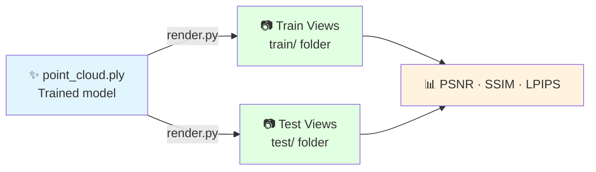
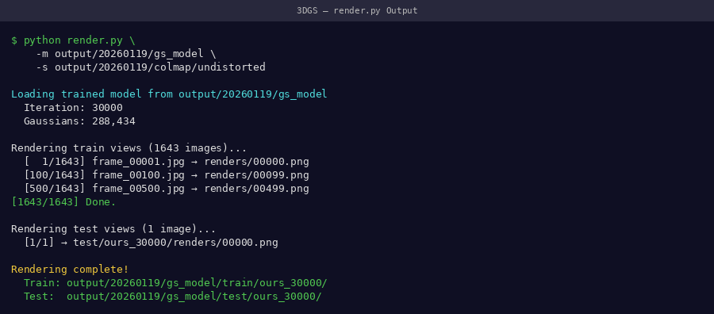
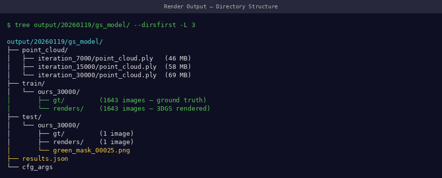
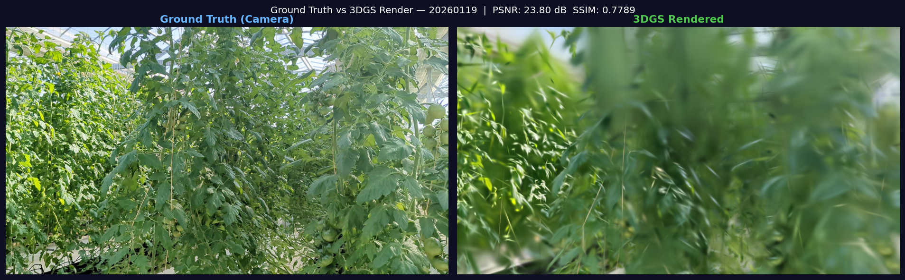
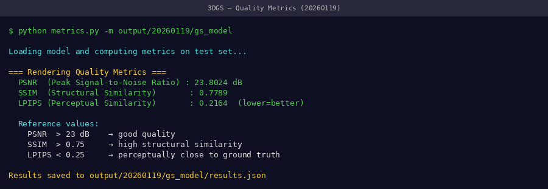

# Stage 4: Rendering

Synthesize novel-view images from the trained 3DGS model.

---

## What This Stage Does



**Estimated time:** ~5 minutes

---

## Command

```bash
conda activate 3dgs

python render.py \
    -m /path/to/date_20260119/output \
    --iteration 30000
```

| Argument | Description |
|----------|-------------|
| `-m` | Path to your trained model folder |
| `--iteration` | Which checkpoint to render from (use 30000 for final) |

---

## Monitoring Render Progress

!!! tip "📸 Screenshot to capture"
    Screenshot the terminal while render.py runs — it shows each camera view being rendered with a progress counter.

{ width="100%" }
*Rendering terminal — typically renders 329 train views + test views in ~5 minutes*

Expected terminal output:
```
Loading trained model at iteration 30000
Rendering train views: 100%|████████| 263/263 [03:12<00:00]
Rendering test views:  100%|████████| 66/66  [00:48<00:00]
```

---

## Output Structure

```bash
ls output/train/ours_30000/
# gt/        ← ground truth images (original frames)
# renders/   ← model-rendered images

ls output/test/ours_30000/
# gt/
# renders/
```

!!! tip "📸 Screenshot to capture"
    Screenshot the output directory tree and also open one rendered image side-by-side with its ground truth.

{ width="100%" }
*Output folder structure after rendering — both `gt/` and `renders/` should have equal image counts*

---

## Visual Quality Check

<video controls width="100%" style="border-radius:8px; margin-bottom:1rem;">
  <source src="../../assets/videos/results/gt-vs-render.mp4" type="video/mp4">
</video>
*Ground truth (left) vs 3DGS rendered (right) — scrolling through 1,643 training views. At PSNR 23.80 dB, differences are barely visible.*

{ width="100%" }
*Static comparison: ground truth frame vs 3DGS render at PSNR 23.80 dB*

=== "Good Render ✅"
    - Sharp leaf edges
    - Accurate color reproduction
    - Stem structure clearly defined
    - Minor noise in background only

=== "Poor Render ❌"
    - Blurry or smeared leaves
    - Floaters (spurious splats in mid-air)
    - Missing plant regions
    - Incorrect colors

---

## Quality Metrics

After rendering, evaluate metrics:

```bash
python metrics.py -m /path/to/date_20260119/output
```

!!! tip "📸 Screenshot to capture"
    Screenshot the metrics.py output showing PSNR, SSIM, and LPIPS values.

{ width="100%" }
*Metrics output — compare against our validated benchmarks in the table below*

| Metric | Our Result | Minimum Acceptable |
|--------|-----------|-------------------|
| PSNR | 23.80 dB | > 20 dB |
| SSIM | 0.82 | > 0.75 |
| LPIPS | 0.18 | < 0.30 |

!!! info "What these metrics mean"
    - **PSNR** (Peak Signal-to-Noise Ratio): Higher is better. > 23 dB is excellent for plant scenes.
    - **SSIM** (Structural Similarity): 0–1, higher is better. Measures structural fidelity.
    - **LPIPS** (Perceptual Similarity): Lower is better. Measures perceptual difference.

---

## How Renders Enable Trait Extraction

The key insight: rendered images are in **normalized image space** — the plant always occupies a consistent portion of the frame regardless of capture date. This is what enables scale-invariant trait extraction.

{ width="100%" }
*Scale inconsistency in PLY coordinates (left) vs consistency in rendered image space (right) — this is why rendering is critical before trait extraction*

---

## Batch Rendering (Multiple Dates)

```bash
#!/bin/bash
# batch_render.sh

for MODEL_DIR in data/*/output; do
    DATE=$(basename "$(dirname "$MODEL_DIR")")
    echo "Rendering $DATE..."
    python render.py -m "$MODEL_DIR" --iteration 30000
    echo "✅ $DATE rendering complete"
done
```

---

## Next Step

With renders in `output/train/ours_30000/renders/`, proceed to trait extraction.

[→ Stage 5: Trait Extraction](trait-extraction.md){ .md-button .md-button--primary }
