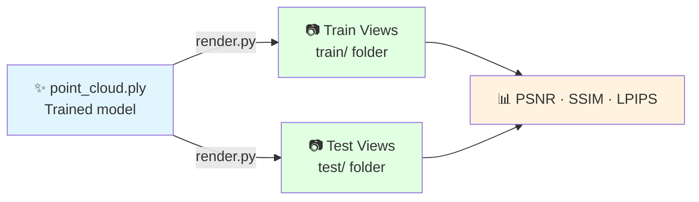

# Stage 4: Rendering

Synthesize novel-view images from the trained 3DGS model.

---

## What This Stage Does



**Estimated time:** ~5 minutes

---

## Command

```bash
conda activate 3dgs

python render.py \
    -m /path/to/date_20260119/output \
    --iteration 30000
```

| Argument | Description |
|----------|-------------|
| `-m` | Path to your trained model folder |
| `--iteration` | Which checkpoint to render from (use 30000 for final) |

---

## Monitoring Render Progress

!!! tip "📸 Screenshot to capture"
    Screenshot the terminal while render.py runs — it shows each camera view being rendered with a progress counter.

{ width="100%" }
*Rendering terminal — typically renders 329 train views + test views in ~5 minutes*

Expected terminal output:
```
Loading trained model at iteration 30000
Rendering train views: 100%|████████| 263/263 [03:12<00:00]
Rendering test views:  100%|████████| 66/66  [00:48<00:00]
```

---

## Output Structure

```bash
ls output/train/ours_30000/
# gt/        ← ground truth images (original frames)
# renders/   ← model-rendered images

ls output/test/ours_30000/
# gt/
# renders/
```

!!! tip "📸 Screenshot to capture"
    Screenshot the output directory tree and also open one rendered image side-by-side with its ground truth.

{ width="100%" }
*Output folder structure after rendering — both `gt/` and `renders/` should have equal image counts*

---

## Visual Quality Check

<video controls width="100%" style="border-radius:8px; margin-bottom:1rem;">
  <source src="../../assets/videos/results/gt-vs-render.mp4" type="video/mp4">
</video>
*Ground truth (left) vs 3DGS rendered (right) — scrolling through 1,643 training views. At PSNR 23.80 dB, differences are barely visible.*

{ width="100%" }
*Static comparison: ground truth frame vs 3DGS render at PSNR 23.80 dB*

=== "Good Render ✅"
    - Sharp leaf edges
    - Accurate color reproduction
    - Stem structure clearly defined
    - Minor noise in background only

=== "Poor Render ❌"
    - Blurry or smeared leaves
    - Floaters (spurious splats in mid-air)
    - Missing plant regions
    - Incorrect colors

---

## Quality Metrics

After rendering, evaluate metrics:

```bash
python metrics.py -m /path/to/date_20260119/output
```

!!! tip "📸 Screenshot to capture"
    Screenshot the metrics.py output showing PSNR, SSIM, and LPIPS values.

{ width="100%" }
*Metrics output — compare against our validated benchmarks in the table below*

| Metric | Our Result | Minimum Acceptable |
|--------|-----------|-------------------|
| PSNR | 23.80 dB | > 20 dB |
| SSIM | 0.82 | > 0.75 |
| LPIPS | 0.18 | < 0.30 |

!!! info "What these metrics mean"
    - **PSNR** (Peak Signal-to-Noise Ratio): Higher is better. > 23 dB is excellent for plant scenes.
    - **SSIM** (Structural Similarity): 0–1, higher is better. Measures structural fidelity.
    - **LPIPS** (Perceptual Similarity): Lower is better. Measures perceptual difference.

---

## How Renders Enable Trait Extraction

The key insight: rendered images are in **normalized image space** — the plant always occupies a consistent portion of the frame regardless of capture date. This is what enables scale-invariant trait extraction.

{ width="100%" }
*Scale inconsistency in PLY coordinates (left) vs consistency in rendered image space (right) — this is why rendering is critical before trait extraction*

### Why PLY Heights Are Meaningless Without Calibration

COLMAP reconstructions are **up-to-scale**: each date gets its own independently-scaled coordinate system. The raw PLY height is in arbitrary world units — **not metres**. Multiplying by a per-date scale factor still produces wildly inconsistent results, making temporal comparison impossible directly from point clouds.

The rendered image height (fraction of frame) is **scale-invariant** and consistent across all dates.

!!! danger "The core problem this pipeline solves"
    Using PLY coordinates directly for plant height measurement gives nonsensical results across dates — heights of 0.81 m, 8.24 m, and 11.17 m for the same plant growing smoothly over a few days. Rendering to a fixed viewpoint eliminates this entirely.

| Date | Raw PLY height | COLMAP scale | "Real" (unreliable ❌) | Rendered height ✅ |
|------|---------------|-------------|----------------------|-------------------|
| Jan 19 | 9.12 (arb.) | 0.089 | ~0.81 m | 85.5% of frame |
| Jan 21 | 16.35 (arb.) | 0.504 | ~8.24 m ❌ | 89.3% of frame |
| Jan 23 | 12.82 (arb.) | 0.486 | ~6.23 m ❌ | 70.3% of frame |
| Jan 26 | 19.82 (arb.) | 0.563 | ~11.17 m ❌ | 89.3% of frame |
| Jan 28 | 7.42 (arb.) | 0.396 | ~2.94 m ❌ | 84.7% of frame |
| Jan 30 | 6.53 (arb.) | 0.495 | ~3.24 m ❌ | 89.8% of frame |
| Feb 2  | 8.87 (arb.) | 0.567 | ~5.03 m ❌ | 62.8% of frame |
| Feb 4  | 9.12 (arb.) | 0.544 | ~4.96 m ❌ | 74.4% of frame |
| Feb 6  | 7.94 (arb.) | 0.539 | ~4.28 m ❌ | 89.9% of frame |
| Feb 9  | 8.95 (arb.) | 0.450 | ~4.03 m ❌ | 89.7% of frame |
| Feb 11 | 7.08 (arb.) | 0.461 | ~3.26 m ❌ | 88.3% of frame |
| Feb 13 | 5.06 (arb.) | 0.538 | ~2.72 m ❌ | 85.9% of frame |
| Feb 16 | 10.44 (arb.) | 0.484 | ~5.06 m ❌ | 86.1% of frame |
| Feb 18 | 6.81 (arb.) | 0.466 | ~3.17 m ❌ | 82.4% of frame |
| Feb 20 | 6.05 (arb.) | 0.483 | ~2.93 m ❌ | 67.6% of frame |
| Feb 23 | 4.74 (arb.) | 0.577 | ~2.74 m ❌ | 89.9% of frame |
| Feb 25 | 16.57 (arb.) | 0.462 | ~7.66 m ❌ | 90.0% of frame |
| Feb 27 | 20.81 (arb.) | 0.524 | ~10.91 m ❌ | 77.9% of frame |
| Mar 2  | 9.12 (arb.) | 0.543 | ~4.95 m ❌ | 89.5% of frame |
| Mar 4  | 10.53 (arb.) | 0.511 | ~5.38 m ❌ | 88.4% of frame |
| Mar 6  | 8.88 (arb.) | 0.549 | ~4.87 m ❌ | 89.1% of frame |
| Mar 9  | 10.32 (arb.) | 0.506 | ~5.22 m ❌ | 89.9% of frame |

**Lesson:** The rendered `height_norm` values are stable (62–90% of frame, reflecting real plant growth). The PLY-derived heights are chaotic and unusable for temporal analysis without a scene-level metric calibration reference.

---

## Batch Rendering (Multiple Dates)

```bash
#!/bin/bash
# batch_render.sh

for MODEL_DIR in data/*/output; do
    DATE=$(basename "$(dirname "$MODEL_DIR")")
    echo "Rendering $DATE..."
    python render.py -m "$MODEL_DIR" --iteration 30000
    echo "✅ $DATE rendering complete"
done
```

---

## Next Step

With renders in `output/train/ours_30000/renders/`, proceed to trait extraction.

[→ Stage 5: Trait Extraction](trait-extraction.md){ .md-button .md-button--primary }
