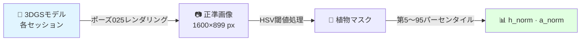

# Stage 5：形質抽出

正準3DGSレンダリング画像から、セッション間の**相対的な生育モニタリング**のためのスケール不変な植物形質信号を抽出します。

!!! note "計測ではなくモニタリング"
    以下の形質（`h_norm`、`a_norm`）は、経時変化の追跡とイベント（例：剪定）の検出を目的とした**正規化・スケール不変**な量です。較正された絶対的な草丈・面積ではなく、セッション間の一貫性（CV）が重要な指標です。[結果・検証](../my-research/results.md#limitations-and-future-ground-truth)を参照してください。

---

## このステージの概要



**推定所要時間：** 1セッションあたり約3分（GPUレンダリング＋解析）

---

## 核心となる革新

従来のPLYベースの手法は三次元座標空間で計測しますが、COLMAPは各日付の再構成に**異なるスケール**を割り当てるため日付間の直接比較ができません。

本手法の解決策：3DGSレンダラーで固定された正準ポーズ — 25番目の保留テストフレーム（テスト分割は8フレームごと）= `cameras.json[200]` = frame_00201、5 fpsで撮影開始から約40秒 — から**正準新視点画像**を合成し、画素空間で草丈を読み取ります。比率によりCOLMAPスケール係数が相殺されます。

---

## Step 1：正準視点のレンダリング

全22セッションで同一の物理視点となる**カメラポーズ025**から植物をレンダリングします。

```python
import json, sys, numpy as np, torch
sys.path.insert(0, '/path/to/gaussian-splatting')
from gaussian_renderer import render, GaussianModel
from utils.graphics_utils import getWorld2View2, getProjectionMatrix

# ネイティブ解像度でカメラポーズ025を読み込み
with open('output/YYYYMMDD/gs_model/cameras.json') as f:
    cam = json.load(f)[200]  # 正準ポーズ = 25番目の保留テストフレーム = frame_00201（約40秒）

W, H = cam['width'], cam['height']
R = np.array(cam['rotation'], dtype=np.float64)
C = np.array(cam['position'], dtype=np.float64)
T = (-R @ C).astype(np.float32)
FoVx = 2 * np.arctan(W / (2 * cam['fx']))
FoVy = 2 * np.arctan(H / (2 * cam['fy']))
```

!!! info "なぜポーズ025？"
    正準ポーズは**25番目の保留テストフレーム**です（テスト分割は8フレームごとにCOLMAP登録フレームを保持）。全カメラの連続リストではこれは `cameras.json[200]` = frame_00201 に相当し、5 fpsで撮影開始から約40秒 — 一度固定して全22セッションで再利用する作物列の視点です。`test/ours_30000/renders/00025.png` としてレンダリングされるため「ポーズ025」と呼びます。

---

## Step 2：植物セグメンテーション（HSV閾値処理）

HSVカラー閾値処理で植物を背景から分離します。

```python
import cv2
import numpy as np

def segment_plant(img_rgb: np.ndarray) -> np.ndarray:
    """
    緑色植生をセグメント。255=植物のバイナリマスクを返す。
    HSV閾値（OpenCV規約、8ビット）：
      色相 : [25, 95]   （度/2）
      彩度 : >= 20
      明度 : >= 30
    """
    img_bgr = cv2.cvtColor(img_rgb, cv2.COLOR_RGB2BGR)
    hsv     = cv2.cvtColor(img_bgr, cv2.COLOR_BGR2HSV)
    mask    = cv2.inRange(hsv,
                          np.array([25,  20,  30]),   # 下限
                          np.array([95, 255, 255]))   # 上限
    return mask
```

!!! warning "閾値の値が重要"
    上記の閾値は論文（§3.3）と完全に一致します。このマニュアルの旧バージョンでは異なる値（[25,40,40]〜[90,255,255]）が示されていましたが、それは誤りです。上記の値を使用してください。

---

## Step 3：スケール不変草丈の抽出

第5〜第95パーセンタイル行を使用して草丈を画像高さの**比率**として計測します。

```python
def extract_traits(mask: np.ndarray) -> dict:
    """
    h_norm  = (r95 - r5) / H_R    （第5〜95パーセンタイル行スパン）
    a_norm  = 緑ピクセル数 / (H_R * W_R)
    どちらも [0, 1] の範囲でスケール不変。
    """
    H, W = mask.shape
    plant_rows = np.where(mask.any(axis=1))[0]

    if len(plant_rows) == 0:
        return {"h_norm": 0.0, "a_norm": 0.0, "valid": False}

    r5  = float(np.percentile(plant_rows, 5))
    r95 = float(np.percentile(plant_rows, 95))

    h_norm = (r95 - r5) / H
    a_norm = float(mask.sum()) / 255.0 / (H * W)

    return {
        "h_norm":     round(h_norm, 4),
        "a_norm":     round(a_norm, 4),
        "height_px":  round(r95 - r5, 1),
        "top_row_px": round(r5, 1),
        "bot_row_px": round(r95, 1),
        "valid":      True,
    }
```

!!! info "なぜ最小/最大行でなく第5〜95パーセンタイルか？"
    最小/最大行は孤立した緑ピクセル（迷い葉、反射など）に影響されます。第5〜95パーセンタイルは外れ値を無視しながら植物の垂直範囲を頑健に推定します。

---

## Step 4：全22セッションで実行

完全な再現性スクリプトは `analysis/compute_heights_rendered.py` です。全セッションをループし、ポーズ025からレンダリングして `analysis/heights_rendered.csv` に書き込みます。

```bash
conda activate gaussian_splatting

python analysis/compute_heights_rendered.py
# オプション：一部のセッションのみ処理
python analysis/compute_heights_rendered.py --dates 20260119 20260123
```

---

## 結果

### 草丈CV比較

| 手法 | CV | 比較 |
|-----|--|------|
| **提案手法（レンダー空間 h_norm）** | **9.8%** | — |
| PLY直接草丈 | 28.0% | 2.86倍悪化 |
| スケール補正PLY | 35.1% | 3.58倍悪化 |
| 生フレームベースライン | 0.0% | *(自明 — 毎セッション同一画像)* |

!!! success "CV 9.8%の意味"
    レンダー空間h_normは22セッション間で9.8%変動します。3回の剪定イベントがそれぞれ15〜27パーセンタイルポイントの低下を引き起こし、背景変動を大きく上回ることから、本手法が計測ノイズではなく実際の生物学的変化を検出できることが確認されました。

---

## 次のステップ

[→ 研究内容：独自の貢献](../my-research/contributions.md){ .md-button .md-button--primary }
[→ 結果・検証](../my-research/results.md){ .md-button }
