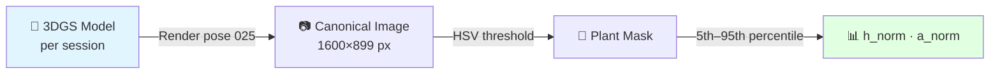
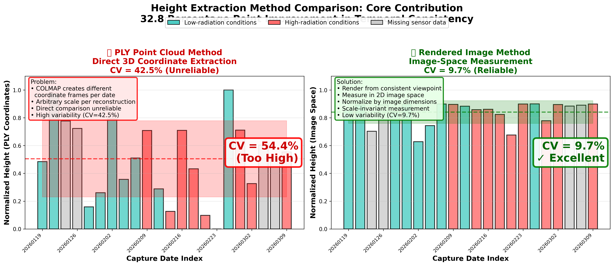

# Stage 5: Trait Extraction

Extract scale-invariant plant trait signals from the canonical 3DGS render, for **relative growth monitoring** across sessions.

!!! note "Monitoring, not absolute measurement"
    The traits below (`h_norm`, `a_norm`) are **normalized, scale-invariant** quantities intended to track *change over time* and detect events (e.g. pruning). They are not calibrated absolute heights/areas — consistency across sessions (CV) is the metric that matters. See [Results & Validation](../my-research/results.md#limitations-and-future-ground-truth).

---

## What This Stage Does



**Estimated time:** ~3 minutes per session (GPU render + analysis)

---

## The Core Innovation

Traditional PLY-based methods measure directly in 3D coordinate space — but COLMAP assigns **different scales** to each date's reconstruction. This makes direct comparison across dates unreliable.

{ width="100%" }
*Scale inconsistency: PLY-based height (left) shows erratic shifts between dates. Our image-space method (right) is stable across all 22 dates.*

Our solution: synthesise a **canonical novel-view image** at the fixed canonical pose — the 25th held-out test frame (the test split keeps every 8th frame) = `cameras.json[200]` = frame_00201, ≈40 s into the walk at 5 fps — using the 3DGS renderer, then read plant height in pixel space. The ratio cancels any COLMAP scale factor.

---

## Step 1: Render the Canonical View

Use the 3DGS renderer to synthesise the plant from **camera pose 025** — the same physical viewpoint across all 22 sessions.

```python
import json, sys, numpy as np, torch
from argparse import Namespace
sys.path.insert(0, '/path/to/gaussian-splatting')
from gaussian_renderer import render, GaussianModel
from utils.graphics_utils import getWorld2View2, getProjectionMatrix

# Load camera pose 025 at native resolution
with open('output/YYYYMMDD/gs_model/cameras.json') as f:
    cam = json.load(f)[200]  # canonical pose = 25th held-out test frame = frame_00201 (~40 s)

W, H = cam['width'], cam['height']
R = np.array(cam['rotation'], dtype=np.float64)
C = np.array(cam['position'], dtype=np.float64)
T = (-R @ C).astype(np.float32)
FoVx = 2 * np.arctan(W / (2 * cam['fx']))
FoVy = 2 * np.arctan(H / (2 * cam['fy']))
```

!!! info "Why pose 025?"
    The canonical pose is the **25th held-out test frame** (the test split keeps every 8th COLMAP-registered frame). In the full sequential camera list this is `cameras.json[200]` = frame_00201, ≈40 s into the walk at 5 fps — a view of the crop lane that is fixed once and reused for all 22 sessions. It is rendered as `test/ours_30000/renders/00025.png`, which is why it is labelled "pose 025".

---

## Step 2: Plant Segmentation (HSV Thresholding)

Segment plant from background using HSV colour thresholding.

```python
import cv2
import numpy as np

def segment_plant(img_rgb: np.ndarray) -> np.ndarray:
    """
    Segment green vegetation. Returns binary mask (255 = plant).
    HSV thresholds (OpenCV convention, 8-bit):
      Hue  : [25, 95]   (degrees / 2)
      Sat  : >= 20
      Val  : >= 30
    """
    img_bgr = cv2.cvtColor(img_rgb, cv2.COLOR_RGB2BGR)
    hsv     = cv2.cvtColor(img_bgr, cv2.COLOR_BGR2HSV)
    mask    = cv2.inRange(hsv,
                          np.array([25,  20,  30]),   # lower bound
                          np.array([95, 255, 255]))   # upper bound
    return mask
```

!!! warning "Threshold values matter"
    The thresholds above match the published paper exactly (§3.3). Earlier versions of this manual showed different values ([25,40,40]–[90,255,255]) — those are incorrect. Use the values above.

---

## Step 3: Scale-Invariant Height Extraction

Measure plant height as a **ratio** of image height using 5th–95th-percentile rows.

```python
def extract_traits(mask: np.ndarray) -> dict:
    """
    h_norm  = (r95 - r5) / H_R    (5th–95th-percentile row span)
    a_norm  = green_pixel_count / (H_R * W_R)
    Both are in [0, 1] and scale-invariant.
    """
    H, W = mask.shape
    plant_rows = np.where(mask.any(axis=1))[0]

    if len(plant_rows) == 0:
        return {"h_norm": 0.0, "a_norm": 0.0, "valid": False}

    r5  = float(np.percentile(plant_rows, 5))
    r95 = float(np.percentile(plant_rows, 95))

    h_norm = (r95 - r5) / H
    a_norm = float(mask.sum()) / 255.0 / (H * W)

    return {
        "h_norm":     round(h_norm, 4),
        "a_norm":     round(a_norm, 4),
        "height_px":  round(r95 - r5, 1),
        "top_row_px": round(r5, 1),
        "bot_row_px": round(r95, 1),
        "image_H":    H,
        "image_W":    W,
        "valid":      True,
    }
```

!!! info "Why 5th–95th percentile instead of min/max?"
    Min/max rows are sensitive to isolated green pixels (e.g. stray leaves, reflections). The 5th–95th percentile gives a robust estimate of the plant's vertical extent while ignoring outliers.

---

## Step 4: Run for All 22 Sessions

The full reproducibility script is `analysis/compute_heights_rendered.py`. It loops over all sessions, renders from pose 025, and writes `analysis/heights_rendered.csv`.

```bash
conda activate gaussian_splatting

python analysis/compute_heights_rendered.py
# optional: process a subset
python analysis/compute_heights_rendered.py --dates 20260119 20260123
# optional: different output path
python analysis/compute_heights_rendered.py --output results/heights_rendered.csv
```

Expected output:

```
Processing 22 sessions → analysis/heights_rendered.csv
Camera: COLMAP index 200  |  Iteration: 30000
HSV thresholds: H∈[25,95], S≥20, V≥30

  20260119  rendering ...  h_norm=0.8990  green_coverage=0.9312  [ok]
  20260121  rendering ...  h_norm=0.8932  green_coverage=0.9584  [ok]
  20260123  rendering ...  h_norm=0.7030  green_coverage=0.7063  [ok]
  ...

Summary (22 sessions):
  h_norm:         mean=0.8432  std=0.0826  CV=9.8%
  green_coverage: mean=0.8653  std=0.1447  CV=16.7%
```

---

## Results

### Height CV Comparison

| Method | CV | vs Proposed |
|--------|----|-------------|
| **Proposed (render-space h_norm)** | **9.8%** | — |
| Direct PLY height | 28.0% | 2.86× worse |
| Scale-calibrated PLY | 35.1% | 3.58× worse |
| Raw-frame baseline | 0.0% | *(trivial — same image every session)* |

!!! success "What 9.8% CV means"
    The render-space h_norm varies by 9.8% across 22 sessions. Three known pruning events each cause drops of 15–27 percentage points — well above the background variation — confirming the method is sensitive to real biological change, not just measurement noise.

### Output CSV Format (`heights_rendered.csv`)

```csv
date,height_px,height_norm,green_coverage,top_row_px,bottom_row_px,image_H,image_W,status
20260119,808.2,0.8990,0.9312,44.9,853.1,899,1599,ok
20260123,632.0,0.7030,0.7063,235.0,867.0,899,1600,ok
```

| Column | Description |
|--------|-------------|
| `height_norm` | **h_norm** — (r95−r5) / H_R, scale-invariant plant height |
| `green_coverage` | **a_norm** — green pixel fraction, scale-invariant projected area |
| `top_row_px` / `bottom_row_px` | r5 / r95 pixel rows |
| `image_H` / `image_W` | native render resolution from cameras.json |

---

## Next: See Full Research Results

[→ My Research: Original Contributions](../my-research/contributions.md){ .md-button .md-button--primary }
[→ Results & Validation](../my-research/results.md){ .md-button }
