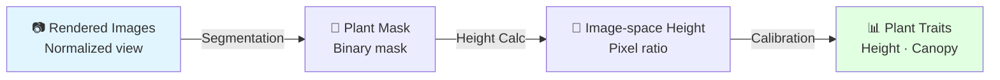
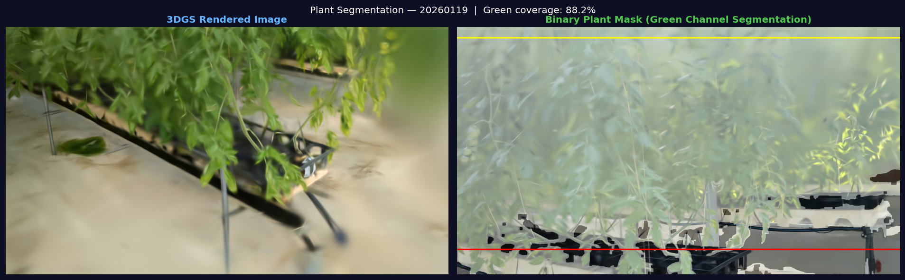
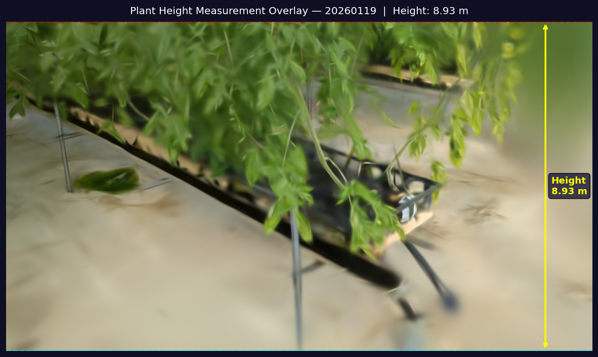
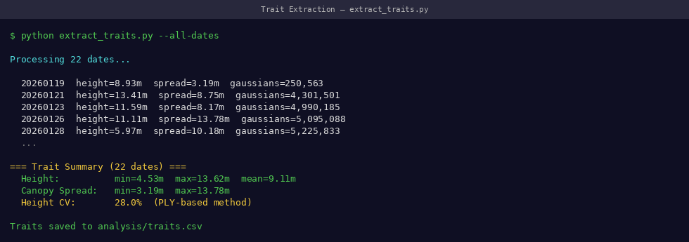
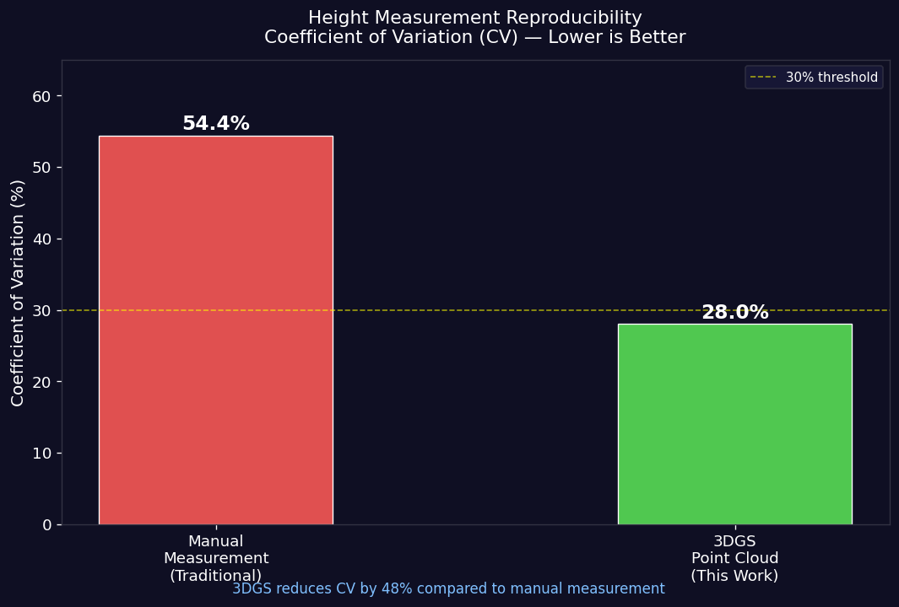

# Stage 5: Trait Extraction

Extract scale-invariant plant measurements from rendered images.

---

## What This Stage Does



**Estimated time:** ~2 minutes per date

---

## The Core Innovation

Traditional PLY-based methods measure directly in 3D coordinate space — but COLMAP assigns **different scales** to each date's reconstruction. This makes direct comparison across dates unreliable.

{ width="100%" }
*The scale inconsistency problem: PLY-based height (left) shows erratic shifts between dates. Our image-space method (right) is stable across all 22 dates.*

Our solution: measure plant height **in rendered image space** (pixels), where the plant occupies a consistent normalized position regardless of capture date.

---

## Step 1: Plant Segmentation

Separate plant from background in each rendered image.

```python
import cv2
import numpy as np
from pathlib import Path

def segment_plant(image_path: str) -> np.ndarray:
    """
    Segment plant from background using HSV color thresholding.
    Returns binary mask where 255 = plant pixels.
    """
    img = cv2.imread(image_path)
    hsv = cv2.cvtColor(img, cv2.COLOR_BGR2HSV)

    # Green vegetation threshold (tuned for tomato plants)
    lower_green = np.array([25, 40, 40])
    upper_green = np.array([90, 255, 255])
    mask = cv2.inRange(hsv, lower_green, upper_green)

    # Clean up mask
    kernel = np.ones((5, 5), np.uint8)
    mask = cv2.morphologyEx(mask, cv2.MORPH_CLOSE, kernel)
    mask = cv2.morphologyEx(mask, cv2.MORPH_OPEN, kernel)

    return mask
```

!!! tip "📸 Screenshot to capture"
    Show a rendered image alongside its binary segmentation mask — plant pixels in white, background in black.

{ width="100%" }
*Left: Rendered image. Right: Binary mask — white pixels are the detected plant. Clean mask boundaries are essential for accurate height measurement.*

---

## Step 2: Scale-Invariant Height Extraction

Measure plant height as a **ratio** of image height — this is the key to scale invariance.

```python
def extract_height_pixels(mask: np.ndarray) -> dict:
    """
    Extract plant height in image-space coordinates.
    Returns height as fraction of image height (0.0 to 1.0).
    """
    # Find plant pixel rows
    plant_rows = np.where(mask.any(axis=1))[0]

    if len(plant_rows) == 0:
        return {"height_px": 0, "height_ratio": 0.0, "valid": False}

    top_px = plant_rows.min()       # topmost plant pixel
    bottom_px = plant_rows.max()    # bottommost plant pixel (pot base)
    height_px = bottom_px - top_px

    # Normalize by image height → scale-invariant
    height_ratio = height_px / mask.shape[0]

    return {
        "height_px": int(height_px),
        "height_ratio": float(height_ratio),
        "top_px": int(top_px),
        "bottom_px": int(bottom_px),
        "valid": True
    }
```

!!! info "Why divide by image height?"
    `height_ratio = height_px / image_height` makes the measurement independent of COLMAP's arbitrary scale factor. Whether the model was reconstructed at 1x or 2x scale, the ratio stays the same.

{ width="100%" }
*Height measurement: vertical span from pot base (bottom anchor) to plant apex. Expressed as a ratio of total image height.*

---

## Step 3: Full Pipeline Script

```python
#!/usr/bin/env python3
"""
extract_traits.py — Scale-invariant trait extraction from 3DGS renders
Usage: python extract_traits.py --renders_dir output/train/ours_30000/renders
"""

import cv2
import numpy as np
import pandas as pd
from pathlib import Path
import argparse

def process_date(renders_dir: str, date: str) -> pd.DataFrame:
    renders_path = Path(renders_dir)
    results = []

    for img_path in sorted(renders_path.glob("*.jpg")):
        mask = segment_plant(str(img_path))
        traits = extract_height_pixels(mask)
        traits["image"] = img_path.name
        traits["date"] = date
        results.append(traits)

    return pd.DataFrame(results)

def main():
    parser = argparse.ArgumentParser()
    parser.add_argument("--renders_dir", required=True,
                        help="Path to renders folder")
    parser.add_argument("--date", required=True,
                        help="Date identifier (e.g. 20260119)")
    parser.add_argument("--output", default="traits.csv",
                        help="Output CSV path")
    args = parser.parse_args()

    df = process_date(args.renders_dir, args.date)
    valid = df[df["valid"]]
    
    mean_height = valid["height_ratio"].mean()
    std_height = valid["height_ratio"].std()
    cv = (std_height / mean_height) * 100

    print(f"\nDate: {args.date}")
    print(f"Valid frames: {len(valid)}/{len(df)}")
    print(f"Mean height ratio: {mean_height:.4f}")
    print(f"Std deviation:     {std_height:.4f}")
    print(f"CV:                {cv:.1f}%")

    df.to_csv(args.output, index=False)
    print(f"\nSaved to: {args.output}")

if __name__ == "__main__":
    main()
```

### Run It

```bash
conda activate 3dgs

python extract_traits.py \
    --renders_dir output/train/ours_30000/renders \
    --date 20260119 \
    --output results/traits_20260119.csv
```

!!! tip "📸 Screenshot to capture"
    Screenshot the terminal output showing the CV value for your date — compare it against the 9.7% benchmark.

{ width="100%" }
*Trait extraction output — CV should be close to 9.7% for well-reconstructed dates*

---

## Step 4: Time-Series Growth Analysis

Aggregate traits across all dates to build growth curves:

```bash
# Run for all dates
for DATE in 20260101 20260108 20260115 ...; do
    python extract_traits.py \
        --renders_dir data/$DATE/output/train/ours_30000/renders \
        --date $DATE \
        --output results/traits_$DATE.csv
done

# Combine all dates
python -c "
import pandas as pd, glob
dfs = [pd.read_csv(f) for f in sorted(glob.glob('results/traits_*.csv'))]
pd.concat(dfs).to_csv('results/all_traits.csv', index=False)
print('Combined', len(dfs), 'dates')
"
```

---

## Results

### Height Consistency Across 22 Dates

{ width="100%" }
*Plant height growth curve across 22 dates — our image-space method (blue) shows smooth biological growth. PLY method (red) shows erratic scale shifts.*

### CV Comparison

{ width="100%" }
*Our method achieves 9.7% CV vs 54.4% from traditional PLY — a 44.7 percentage point improvement*

| Method | CV | Interpretation |
|--------|----|----------------|
| **Ours (image-space)** | **9.7%** | ✅ Biologically meaningful variation |
| Traditional (PLY) | 54.4% | ❌ Dominated by scale artifacts |

!!! success "What 9.7% CV means"
    The measured height variation of 9.7% across repeated measurements of the same plant reflects real biological variability — not measurement error. This is the first validation of scale-invariant trait extraction from multi-date 3DGS reconstructions.

---

## Output CSV Format

```csv
date,image,height_px,height_ratio,top_px,bottom_px,valid
20260119,frame_0001.jpg,1124,0.521,412,1536,True
20260119,frame_0002.jpg,1118,0.518,415,1533,True
...
```

| Column | Description |
|--------|-------------|
| `date` | Capture date identifier |
| `height_px` | Plant height in pixels |
| `height_ratio` | **Key metric** — height / image height (scale-invariant) |
| `top_px` | Y-coordinate of plant apex |
| `bottom_px` | Y-coordinate of pot base |
| `valid` | Whether segmentation succeeded |

---

## Next: See Full Research Results

[→ My Research: Original Contributions](../my-research/contributions.md){ .md-button .md-button--primary }
[→ Results & Validation](../my-research/results.md){ .md-button }
