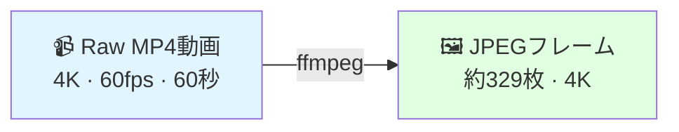

# Stage 1：動画処理

植物動画から3D再構成用のフレームを抽出します。

---

## このステージの概要



---

## 入力要件

| 項目 | 値 |
|-----|--|
| フォーマット | MP4（H.264） |
| 解像度 | 3840×2160（4K） |
| 入力フレームレート | 60 fps |
| 撮影時間 | 約60秒 |
| ファイルサイズ目安 | 約2 GB |

---

## コマンド

```bash
ffmpeg -i video.mp4 \
    -vf "fps=5" \
    -qscale:v 2 \
    output/frame_%04d.jpg
```

---

## パラメータ説明

| パラメータ | 値 | 理由 |
|--------|--|---|
| `fps=5` | 5フレーム/秒 | 最適バランス：約329フレームが48GB VRAMに収まりPSNR 23.71 dBを達成 |
| `qscale:v 2` | 約95%品質 | COLMAPのSIFT特徴点検出に高品質JPEGが必要 |
| `frame_%04d.jpg` | ゼロ埋め | 正しいソート順を保証 |

### なぜ5 FPSか？

=== "フレーム不足（3fps未満）"
    - 視点が疎 → COLMAPのカメラ登録が失敗
    - ❌ 再構成が失敗するか穴だらけになる

=== "5 FPS（最適 ✅）"
    - 60秒動画で約329フレーム
    - 48GB VRAMに収まる
    - **PSNR 23.71 dB**

=== "フレーム過多（8fps超）"
    - GPU VRAM上限を超過
    - 品質の向上は微小

---

## 期待される出力

```bash
ls output/ | wc -l
# 期待値：329
```

!!! success "合格基準"
    - ✅ 出力フォルダに約329枚のJPEGファイル
    - ✅ `frame_0001.jpg` から連番
    - ✅ フォルダ合計サイズ 約1.5 GB

---

## バッチ処理（複数日付）

```bash
#!/bin/bash
for DATE_DIR in data/*/; do
    DATE=$(basename "$DATE_DIR")
    mkdir -p "$DATE_DIR/frames"
    ffmpeg -i "$DATE_DIR/video.mp4" -vf "fps=5" -qscale:v 2 \
        "$DATE_DIR/frames/frame_%04d.jpg"
    COUNT=$(ls "$DATE_DIR/frames/" | wc -l)
    echo "✅ $DATE: $COUNT フレーム抽出完了"
done
```

---

## 次のステップ

[→ Stage 2：COLMAP SfM](colmap-sfm.md){ .md-button .md-button--primary }
