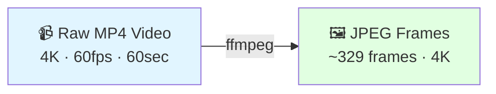
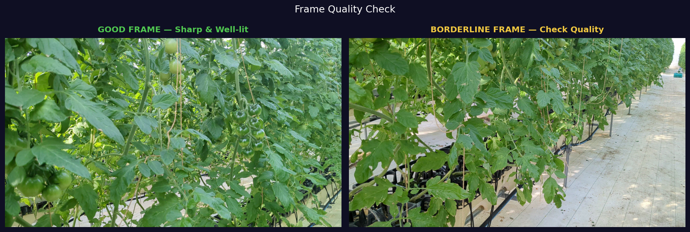

# Stage 1: Video Processing

Extract frames from raw plant videos for 3D reconstruction.

---

## What This Stage Does



---

## Input Requirements

| Property | Value |
|----------|-------|
| Format | MP4 (H.264) |
| Resolution | 3840×2160 (4K) |
| Source frame rate | 60 fps |
| Duration | ~60 seconds |
| Typical file size | ~2 GB |

{ width="100%" }
*Example input: 4K frame from Google Pixel 6a showing greenhouse plant*

---

## Stage Walkthrough

<video controls width="100%" style="border-radius:8px; margin-bottom:1rem;">
  <source src="../../assets/videos/demos/3dgs-360-view.mp4" type="video/mp4">
</video>
*Raw video → extracted frames → 3DGS novel-view orbit — the full journey from capture to 3D reconstruction*

---

## Command

```bash
ffmpeg -i video.mp4 \
    -vf "fps=5" \
    -qscale:v 2 \
    output/frame_%04d.jpg
```

!!! tip "📸 Screenshot to capture"
    Open a terminal, run the command above, and screenshot the ffmpeg progress output — it shows frame count, time elapsed, and speed.

{ width="100%" }
*ffmpeg terminal output during frame extraction — watch for the frame counter*

---

## Parameter Explanation

| Parameter | Value | Why |
|-----------|-------|-----|
| `fps=5` | 5 frames/sec | Optimal balance: ~329 frames fit in 48GB VRAM with PSNR 23.80 dB |
| `qscale:v 2` | ~95% quality | High-fidelity JPEG needed for SIFT feature detection in COLMAP |
| `frame_%04d.jpg` | Zero-padded | Ensures correct sort order (frame_0001.jpg → frame_0329.jpg) |

### Why 5 FPS? (Not More, Not Less)

=== "Too Few Frames (< 3 fps)"
    - Sparse views → COLMAP fails to register cameras
    - Large gaps between frames → weak feature matching
    - ❌ Reconstruction fails or has holes

=== "5 FPS (Optimal ✅)"
    - ~329 frames for 60-second video
    - Dense enough for COLMAP feature matching
    - Fits within 48GB VRAM
    - **PSNR: 23.80 dB** on our dataset

=== "Too Many Frames (> 8 fps)"
    - Redundant frames → slow COLMAP matching
    - Exceeds GPU VRAM limit
    - Diminishing returns on reconstruction quality

---

## Expected Output

After running ffmpeg, your output folder should look like this:

{ width="100%" }
*File explorer showing extracted frames — check the count matches ~329 for a 60s video*

```bash
# Verify frame count
ls output/ | wc -l
```

Expected result:
```
329
```

!!! success "Success Criteria"
    - ✅ ~329 JPEG files in output folder
    - ✅ Files named `frame_0001.jpg` through `frame_0329.jpg`  
    - ✅ Each file ~4–6 MB (4K resolution)
    - ✅ Total folder size ~1.5 GB

!!! warning "If frame count is wrong"
    - **< 100 frames:** Check your video duration — it may be shorter than 60 seconds
    - **> 500 frames:** Your input video may already be at a low frame rate — use `ffprobe video.mp4` to check

---

## Quality Check

Spot-check a few frames visually before continuing to COLMAP:

{ width="100%" }
*Left: Good sharp frame suitable for SIFT features. Right: Motion blur — avoid videos with camera shake*

```bash
# Preview frame 100 quickly (requires eog or display on Ubuntu)
eog output/frame_0100.jpg
```

!!! danger "Reject videos with these problems"
    - Motion blur (camera moved while recording)
    - Overexposed or underexposed frames
    - Partial plant view (plant cut off at edges)

---

## Batch Processing (Multiple Dates)

To process a full time-series dataset with multiple dates:

```bash
#!/bin/bash
# batch_extract.sh — run for each date folder

for DATE_DIR in data/*/; do
    DATE=$(basename "$DATE_DIR")
    mkdir -p "$DATE_DIR/frames"
    
    ffmpeg -i "$DATE_DIR/video.mp4" \
        -vf "fps=5" \
        -qscale:v 2 \
        "$DATE_DIR/frames/frame_%04d.jpg"
    
    COUNT=$(ls "$DATE_DIR/frames/" | wc -l)
    echo "✅ $DATE: $COUNT frames extracted"
done
```

{ width="100%" }
*Batch extraction across 22 dates — each line confirms successful extraction*

---

## Disk Space Estimate

| Dates | Frames per date | Total frames | Disk space |
|-------|----------------|--------------|------------|
| 1 | ~329 | 329 | ~1.5 GB |
| 10 | ~329 | 3,290 | ~15 GB |
| 22 | ~329 | 7,238 | ~33 GB |

---

## Next Step

Proceed to COLMAP once all frames are extracted and quality-checked.

[→ Stage 2: COLMAP SfM](colmap-sfm.md){ .md-button .md-button--primary }
